# Plan de Acción Correctiva

**Código**: PAC-SDLC-ASTRALOG-001 · **Versión**: 1.0 · **Estado**: Aprobado

## Objetivo

Establecer las acciones que deberán ejecutarse para atender las oportunidades de mejora y la
no conformidad identificadas durante la Auditoría SDLC del proyecto AstraLog, fortaleciendo
la calidad, mantenibilidad, seguridad y confiabilidad del sistema.

## Alcance

Comprende las acciones correctivas derivadas de los hallazgos H-006, H-007, H-009 y H-010,
documentados en la [Matriz de Hallazgos](../hallazgos/matriz-hallazgos.md).

## Plan de acción correctiva

| Código | Hallazgo | Acción Correctiva | Responsable | Prioridad | Plazo | Estado |
|---|---|---|---|---|---|---|
| H-006 | Documentación limitada de pruebas unitarias automatizadas. | Diseñar, ejecutar y documentar pruebas unitarias automatizadas para los módulos críticos del sistema, incorporando la evidencia correspondiente al repositorio del proyecto. | Equipo de Desarrollo / QA | **Alta** | 30 días | Pendiente |
| H-007 | Documentación técnica susceptible de mejora. | Actualizar el manual técnico, incorporando procedimientos de mantenimiento, despliegue, arquitectura y configuración del sistema. | Equipo Técnico | Media | 20 días | Pendiente |
| H-009 | Ausencia de un proceso formal de Integración y Despliegue Continuo (CI/CD). | Diseñar e implementar un flujo básico de CI/CD utilizando herramientas compatibles con el proyecto, automatizando la compilación y validación del sistema. | Equipo de Desarrollo | Media | 45 días | Pendiente |
| H-010 | Falta de un procedimiento formal para la gestión de incidencias. | Elaborar un procedimiento documentado para el registro, clasificación, atención y seguimiento de incidencias. | Líder del Proyecto | Media | 30 días | Pendiente |

## Cronograma de implementación

```mermaid
gantt
    title Cronograma de implementación del Plan de Acción Correctiva
    dateFormat  X
    axisFormat  Semana %s
    section Pruebas unitarias
    Documentación de pruebas unitarias :a1, 0, 3
    section Documentación
    Actualización de documentación técnica :a2, 0, 3
    section CI/CD
    Implementación del proceso CI/CD :a3, 1, 4
    section Mantenimiento
    Procedimiento de mantenimiento e incidencias :a4, 1, 3
```

## Mecanismo de seguimiento

El cumplimiento se verifica mediante reuniones periódicas entre el equipo auditor y el
equipo de desarrollo de AstraLog. Cada acción se clasifica en uno de los siguientes estados:
**Pendiente** → **En proceso** → **Implementada** → **Verificada** → **Cerrada**.

## Criterios de cierre

Una acción correctiva se considera cerrada cuando:

- Ha sido implementada completamente.
- Existe evidencia documental que demuestra su ejecución.
- El equipo auditor verifica el cumplimiento de la recomendación.
- Se confirma que el riesgo asociado ha sido mitigado o reducido.

## Indicadores de seguimiento

| Indicador | Fórmula | Meta |
|---|---|---|
| Acciones implementadas | (Acciones implementadas / Total de acciones) × 100 | 100 % |
| Hallazgos cerrados | (Hallazgos cerrados / Total de hallazgos con acciones) × 100 | 100 % |
| Riesgos mitigados | (Riesgos mitigados / Riesgos tratados) × 100 | ≥ 90 % |
| Cumplimiento del cronograma | (Acciones ejecutadas en la fecha prevista / Total de acciones) × 100 | ≥ 90 % |

## Beneficios esperados

Fortalecer la calidad del proceso de desarrollo, mejorar la documentación técnica y
funcional, incrementar la cobertura y trazabilidad de las pruebas, optimizar el despliegue
mediante integración continua, formalizar la gestión de incidencias, reducir los riesgos
identificados y favorecer la mejora continua del proyecto AstraLog.
