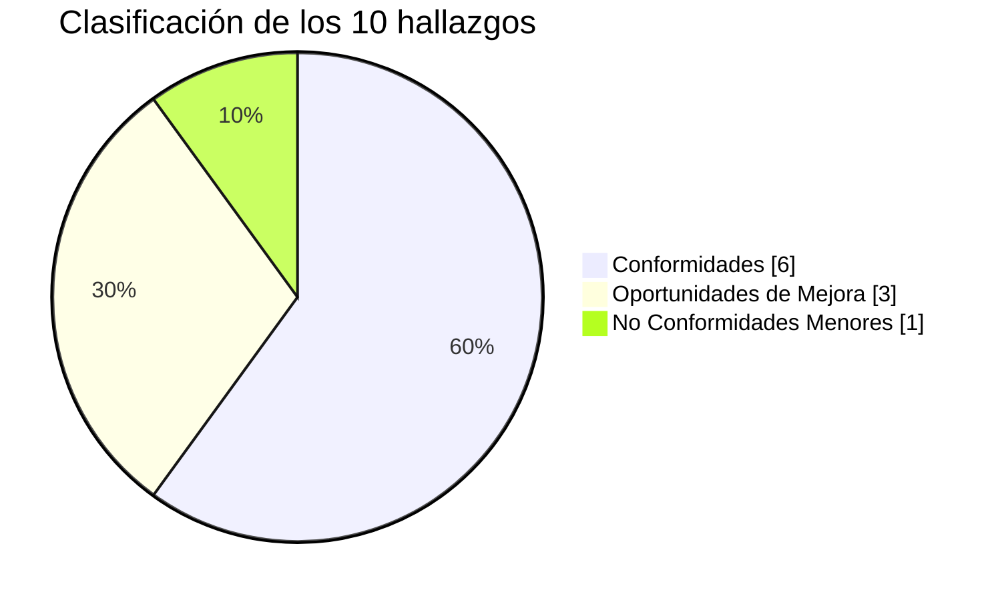

# Matriz de Hallazgos

**Código**: MH-SDLC-ASTRALOG-001 · **Versión**: 1.0 · **Estado**: Aprobado

## Criterios de clasificación

| Clasificación | Descripción |
|---|---|
| Conformidad | El proceso o actividad cumple con los criterios establecidos y existe evidencia suficiente que lo respalda. |
| Oportunidad de Mejora | El proceso cumple con los criterios; sin embargo, se identifican acciones que podrían incrementar la eficiencia, mantenibilidad o calidad. |
| No Conformidad Menor | Incumplimiento parcial de un criterio, sin comprometer significativamente la calidad o continuidad del sistema. |

## Matriz de hallazgos

| Código | Área Auditada | Hallazgo | Criterio de Auditoría | Clasificación | Recomendación |
|---|---|---|---|---|---|
| H-001 | Gestión del Proyecto | Se verificó la planificación y seguimiento del proyecto mediante Scrum y Jira. | ISO/IEC 12207 – Gestión del Proyecto | **Conformidad** | Mantener las prácticas de gestión implementadas. |
| H-002 | Gestión de Requisitos | Los requisitos funcionales y no funcionales fueron documentados y gestionados mediante historias de usuario. | ISO/IEC 12207 – Ingeniería de Requisitos | **Conformidad** | Mantener la trazabilidad entre requisitos y funcionalidades. |
| H-003 | Arquitectura del Sistema | La arquitectura monolítica modular documentada presenta coherencia con la implementación desarrollada. | Modelo C4 / Buenas prácticas de diseño | **Conformidad** | Actualizar la documentación cuando existan cambios arquitectónicos. |
| H-004 | Desarrollo del Software | Se evidenció el uso de GitHub, control de versiones y revisiones mediante Pull Requests. | CMMI-DEV – Gestión de Configuración | **Conformidad** | Continuar aplicando revisiones de código en futuras versiones. |
| H-005 | Seguridad | Se comprobaron mecanismos de autenticación y autorización basados en JWT y roles. | ISO/IEC 25010 – Seguridad | **Conformidad** | Revisar periódicamente la configuración de seguridad. |
| H-006 | Pruebas | La evidencia de pruebas unitarias automatizadas es limitada. | ISO/IEC 25010 – Fiabilidad | **No Conformidad Menor** | Diseñar, ejecutar y documentar pruebas unitarias automatizadas para los módulos críticos. |
| H-007 | Documentación | El proyecto dispone de documentación técnica y manuales; no obstante, algunos procedimientos pueden detallarse con mayor profundidad. | Estándares de Documentación | **Oportunidad de Mejora** | Complementar la documentación técnica con procedimientos de mantenimiento y despliegue. |
| H-008 | Base de Datos | La estructura de la base de datos MySQL es consistente con los requisitos funcionales del sistema. | Buenas prácticas de diseño de bases de datos | **Conformidad** | Mantener el control de versiones de scripts SQL y respaldos periódicos. |
| H-009 | Implementación | El sistema dispone de procedimientos de instalación; sin embargo, no se evidencia un proceso automatizado de integración y despliegue continuo (CI/CD). | Buenas prácticas DevOps | **Oportunidad de Mejora** | Evaluar la incorporación de herramientas de integración y despliegue continuo. |
| H-010 | Mantenimiento | Se identificó el control de versiones del software, aunque no existe un procedimiento formal de gestión de incidencias posteriores al despliegue. | ISO/IEC 12207 – Mantenimiento | **Oportunidad de Mejora** | Definir un procedimiento formal para la gestión de incidencias, cambios y mantenimiento correctivo. |

## Resumen de hallazgos

| Clasificación | Cantidad |
|---|---|
| Conformidades | 6 |
| Oportunidades de Mejora | 3 |
| No Conformidades Menores | 1 |
| No Conformidades Mayores | 0 |
| **Total de Hallazgos** | **10** |

## Conclusiones generales

El proyecto AstraLog presenta un adecuado nivel de cumplimiento de los criterios
establecidos para la Auditoría SDLC. Las evidencias revisadas demuestran la aplicación de
buenas prácticas en gestión del proyecto, desarrollo, arquitectura, seguridad, gestión de
requisitos y control de versiones. Se identificaron oportunidades de mejora relacionadas con
documentación técnica, automatización del despliegue y formalización del mantenimiento, así
como una no conformidad menor asociada a la limitada documentación de pruebas unitarias
automatizadas.
