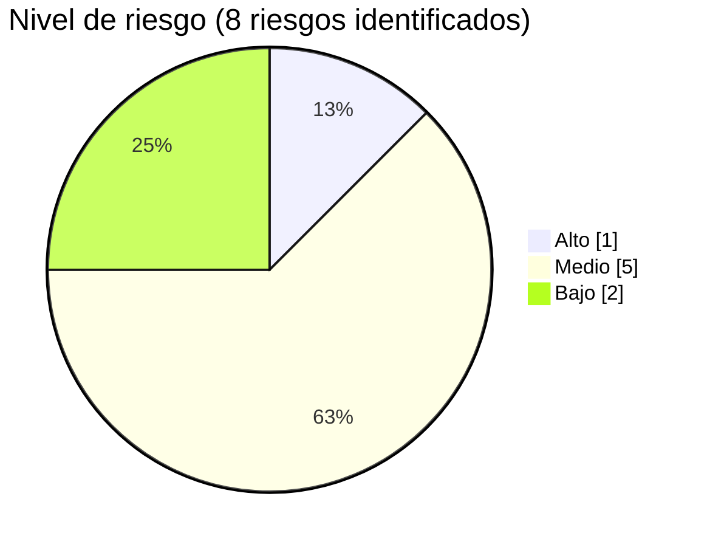

# Matriz de Riesgos

**Código**: MR-SDLC-ASTRALOG-001 · **Versión**: 1.0 · **Estado**: Aprobado

## Metodología de evaluación

**Probabilidad**: Baja (poco probable) · Media (puede ocurrir en determinadas
circunstancias) · Alta (alta posibilidad de ocurrencia).

**Impacto**: Bajo (consecuencias menores) · Medio (afecta parcialmente la operación o
calidad) · Alto (compromete significativamente el funcionamiento o mantenimiento).

**Nivel de riesgo**: Bajo (riesgo aceptable, requiere seguimiento) · Medio (requiere
acciones de mitigación) · Alto (requiere atención prioritaria e inmediata).

## Matriz de riesgos

| Código | Riesgo identificado | Hallazgo relacionado | Probabilidad | Impacto | Nivel | Acción de mitigación | Responsable |
|---|---|---|---|---|---|---|---|
| R-001 | Dificultad para detectar errores en futuras modificaciones debido a la limitada documentación de pruebas unitarias automatizadas. | H-006 | Media | Alto | **Alto** | Implementar pruebas unitarias automatizadas y documentar su ejecución para los módulos críticos. | Equipo de Desarrollo / QA |
| R-002 | Incremento del tiempo requerido para actividades de mantenimiento por documentación técnica insuficientemente detallada. | H-007 | Media | Medio | Medio | Actualizar y ampliar la documentación técnica y operativa del sistema. | Equipo Técnico |
| R-003 | Retrasos y mayor probabilidad de errores durante la implementación por ausencia de un proceso de integración y despliegue continuo (CI/CD). | H-009 | Media | Medio | Medio | Incorporar herramientas de integración y despliegue continuo. | Equipo DevOps / Desarrollo |
| R-004 | Dificultad para gestionar incidencias posteriores al despliegue debido a la inexistencia de un procedimiento formal de mantenimiento. | H-010 | Media | Medio | Medio | Definir e implementar un procedimiento formal de gestión de incidencias, cambios y mantenimiento correctivo. | Líder del Proyecto |
| R-005 | Desactualización de la arquitectura y documentación técnica ante futuras modificaciones del sistema. | H-003 / H-007 | Baja | Medio | Bajo | Establecer revisiones periódicas de la documentación arquitectónica y técnica. | Arquitecto del Software |
| R-006 | Configuración incorrecta de roles y permisos en futuras versiones del sistema. | H-005 | Baja | Alto | Medio | Revisar periódicamente la configuración de seguridad y realizar auditorías de permisos antes de cada liberación. | Administrador del Sistema |
| R-007 | Pérdida de información por fallas en la ejecución o seguimiento de los procedimientos de respaldo de la base de datos MySQL. | H-008 | Baja | Alto | Medio | Programar respaldos automáticos y realizar pruebas periódicas de restauración de la base de datos. | Administrador de Base de Datos |
| R-008 | Desviaciones en la planificación de futuras versiones del sistema si no se mantiene la disciplina en la gestión ágil del proyecto. | H-001 | Baja | Medio | Bajo | Continuar utilizando Scrum, Jira y reuniones periódicas de seguimiento para el control del proyecto. | Scrum Master |

## Resumen y priorización

| Prioridad | Código | Riesgo |
|---|---|---|
| 1 | R-001 | Insuficiente documentación de pruebas unitarias automatizadas. |
| 2 | R-003 | Ausencia de un proceso de integración y despliegue continuo (CI/CD). |
| 3 | R-004 | Falta de un procedimiento formal para la gestión de incidencias y mantenimiento. |
| 4 | R-002 | Documentación técnica con oportunidades de mejora. |
| 5 | R-006 | Riesgo asociado a la configuración de roles y permisos. |
| 6 | R-007 | Riesgo relacionado con respaldos y recuperación de la base de datos. |
| 7 | R-005 | Desactualización de la documentación arquitectónica. |
| 8 | R-008 | Riesgo de desviaciones en la planificación de futuras versiones. |

## Conclusiones

La evaluación de riesgos evidencia que el proyecto AstraLog presenta un nivel adecuado de
control sobre la mayoría de sus procesos de desarrollo. Los riesgos identificados se
concentran en aspectos de mejora continua: automatización de pruebas, documentación técnica,
integración continua y formalización del mantenimiento. No se identificaron riesgos críticos
que comprometan la viabilidad del sistema.
