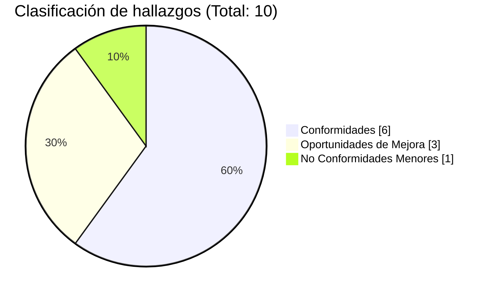
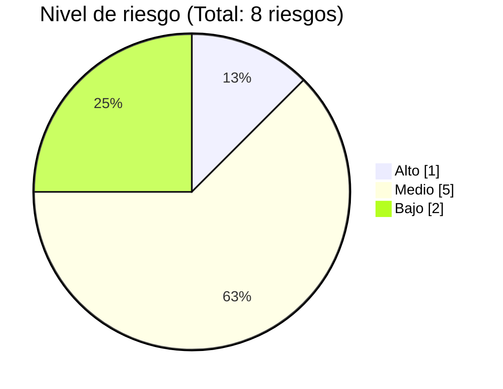

# Auditoría SDLC — AstraLog III

Documentación de la **Auditoría del Ciclo de Vida del Desarrollo de Software (SDLC)**
realizada al proyecto **AstraLog – Solución Logística Centralizada**, desarrollado para
**ASTRAMACO III**.

| Campo | Información |
|---|---|
| Proyecto auditado | AstraLog – Solución Logística Centralizada |
| Organización auditada | ASTRAMACO III |
| Auditor Líder | Anthony Kelman Mamani Vargas |
| Auditor Técnico | Jeimy Paul Ramos Coaquira |
| Auditor Documental | Yunior Benito Quispe Quispe |
| Líder del Proyecto AstraLog | Elvis Jesús Apaza Yucra |
| Representante ASTRAMACO III | María de los Andes Apaza Quispe |
| Fecha de cierre de la auditoría | Junio 2026 |
| Estado | Aprobado |

## Resultado general

El equipo auditor concluye que el proyecto AstraLog presenta un **adecuado nivel de
cumplimiento** de las buenas prácticas de Ingeniería de Software y de los criterios definidos
para la Auditoría SDLC (ISO/IEC 12207, ISO/IEC 25010, CMMI-DEV), con una **opinión
favorable** general y un riesgo prioritario asociado a la limitada documentación de pruebas
unitarias automatizadas.

## Fases de la auditoría

- **[Fase 1 — Preparar y Planificar](fases/fase-1.md)**
- **[Fase 2 — Describir el Proceso de Desarrollo](fases/fase-2.md)**
- **Fase 3 — Evaluar y Reportar**: [Matriz de Hallazgos](hallazgos/matriz-hallazgos.md) ·
  [Matriz de Riesgos](hallazgos/matriz-riesgos.md) ·
  [Informe Final de Auditoría](hallazgos/informe-final.md)
- **Fase 4 — Seguimiento**: [Plan de Acción Correctiva](fases/plan-accion-correctiva.md) ·
  [Acta de Cierre](fases/acta-cierre.md)
- **[Discrepancias detectadas](discrepancias.md)**
