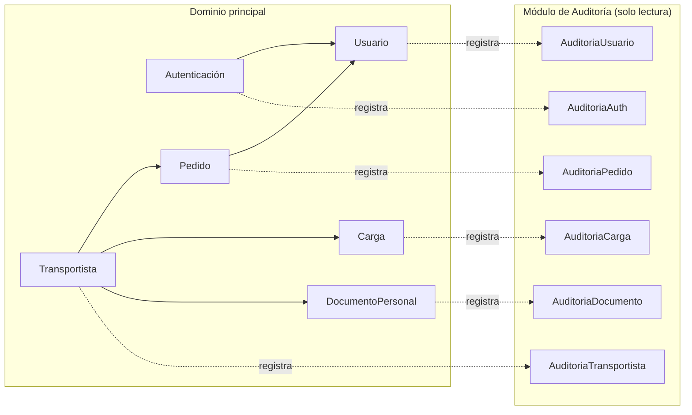

# Arquitectura modular

El backend organiza el dominio del negocio en módulos funcionales independientes,
identificados a partir de los paquetes `controller`, `model`, `service` y `repository`.

## Módulos identificados

### Módulo de Autenticación
- **Responsabilidad**: validar credenciales y emitir tokens JWT.
- **Componentes**: `AuthController`, `JwtUtil`, `JwtFilter`, `SecurityConfig`.
- **Endpoint**: `POST /api/auth/login`.

### Módulo de Usuarios
- **Responsabilidad**: gestión de cuentas, roles y estado (activo/inactivo).
- **Entidad**: `Usuario` (username, password, `rol`, `activo`).
- **Roles** (`enum Rol`): `ADMIN`, `USER`, `TRANSPORTISTA`.

### Módulo de Pedidos
- **Responsabilidad**: registro y ciclo de vida de los pedidos de transporte de materiales.
- **Entidad**: `Pedido`.
- **Estados** (`enum EstadoPedido`): `EN_ENVIO`, `EN_DESCARGA`, `ENTREGADO`, `CANCELADO`.

### Módulo de Cargas
- **Responsabilidad**: registro de cargas asociadas a un transportista, con historial.
- **Entidad**: `Carga`.
- **Tipos de material** (`enum TipoMaterial`): `PANDERETA`, `TECHO`, `ARENA_GRUESA`,
  `ARENA_FINA`, `ARENA_ASENTAR`, `PIEDRA`, `DESMONTE`.

### Módulo de Transportistas
- **Responsabilidad**: gestión de transportistas, su tipo de transporte y documentación.
- **Entidad**: `Transportista`.
- **Estados** (`enum EstadoTransportista`): `ACTIVO`, `INACTIVO`.
- **Tipos de transporte** (`enum TipoTransporte`): `VOLQUETERO`, `CAMIONERO`.

### Módulo de Documentación Personal
- **Responsabilidad**: gestión de documentos obligatorios del transportista.
- **Entidad**: `DocumentoPersonal`.
- **Tipos de documento** (`enum TipoDocumento`): `SOAT`, `REVISION_TECNICA`, `LICENCIA`,
  `TARJETA_CIRCULACION`, `DNI`.

### Módulo de Auditoría
- **Responsabilidad**: exponer, en modo solo lectura, el historial de acciones sobre cada
  dominio principal (`/api/auditoria/**`), filtrable por entidad relacionada, tipo de acción
  o rango de fechas, con endpoints de resumen.
- Coincide con el objetivo específico **OE9 – Seguridad** y con el criterio de
  "trazabilidad" señalado en el Project Charter de Auditoría SDLC.

!!! info "Base para el diagrama"
    Este diagrama refleja únicamente relaciones verificables en el código: paquetes,
    controladores y entidades JPA existentes en la rama `final-trabajo` del backend. No se
    representan relaciones de base de datos (claves foráneas) que no fueron confirmadas
    dentro del alcance de este análisis de código estático.
