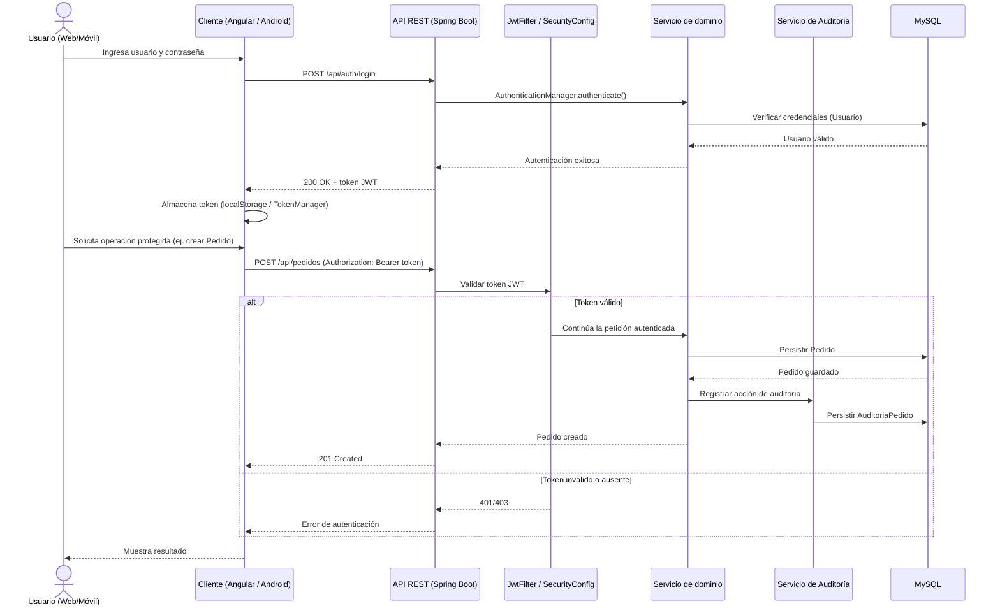

# Flujo general del sistema

Recorrido de una petición típica, desde el inicio de sesión hasta una operación protegida
sobre un pedido, tal como está implementado en `SecurityConfig`, `JwtFilter` y los
controladores REST.

## Pasos del flujo

1. **Autenticación**: el cliente envía credenciales a `POST /api/auth/login`. El
   `AuthenticationManager` de Spring Security valida contra la entidad `Usuario` y, si es
   correcta, `JwtUtil` genera un token firmado (HMAC) con expiración configurable
   (`app.jwt.expiration-ms`, por defecto 24 h).
2. **Almacenamiento del token**: el Frontend Web lo guarda en `localStorage`
   (`AuthService.guardarToken`); la Aplicación Móvil lo gestiona mediante `TokenManager`.
3. **Validaciones en cada petición protegida**: `SecurityConfig` define que todas las rutas
   requieren autenticación (`anyRequest().authenticated()`), salvo las explícitamente
   permitidas (`permitAll()`) y una regla específica: `POST /api/usuarios` requiere el rol
   `ADMIN`.
4. **Comunicación entre capas**: `Controller → Service → Repository (Spring Data JPA) → MySQL`.
5. **Registro de auditoría**: las operaciones sobre los dominios principales generan un
   registro espejo en el módulo de auditoría (`model/audit`), consultable después mediante
   los endpoints `GET /api/auditoria/**`.
6. **Manejo de errores**: `CorsConfig` habilita CORS para los clientes web/móvil; los errores
   de autenticación devuelven `401`, y las validaciones de payload (anotación `@Valid` sobre
   los DTOs) devuelven `400` con el detalle del error.
