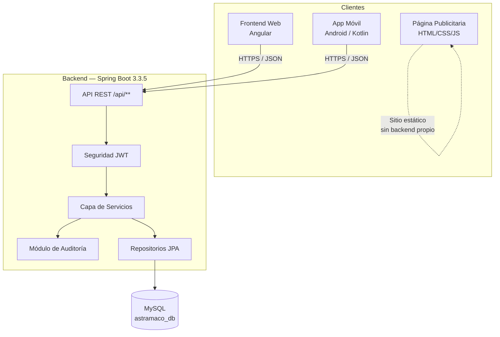

# Visión general de la arquitectura

## Objetivo del sistema

Centralizar la gestión logística y comercial de ASTRAMACO III: registro de pedidos, asignación
de transportistas, control de cargas y documentación personal de los transportistas
(licencia, SOAT, revisión técnica, tarjeta de circulación, DNI), con trazabilidad de auditoría
sobre cada operación.

## Usuarios involucrados

- **Administrador / Gerencia logística**, a través del **Frontend Web**: gestiona usuarios,
  pedidos, transportistas y consulta reportes de auditoría.
- **Transportistas**, a través de la **Aplicación Móvil**: reciben pedidos asignados,
  reportan cargas y gestionan su documentación personal.
- **Visitantes / clientes potenciales**, a través de la **Página Publicitaria**: sitio estático
  de presentación institucional de ASTRAMACO III.

## Estilo arquitectónico

El backend es un **monolito modular** construido en **Java 17 con Spring Boot 3.3.5**,
organizado por dominios (`controller`, `service`, `repository`, `model`, `dto`), con un
submódulo transversal de auditoría (`controller/auditoria`, `model/audit`,
`repository/audit`, `service/audit`) que registra cada operación relevante sobre las
entidades principales.

Backend, frontend web, app móvil y página publicitaria son **desplegables de forma
independiente** y se comunican mediante una **API REST** expuesta por el backend, protegida
con **JWT**.

## Componentes principales

!!! note "Página Publicitaria"
    La Página Publicitaria (`PaginaPublicitaria-AstramacoIII`, rama `main`) es un sitio
    estático (`index.html`, `main.js`, `styles.css`) sin backend propio ni conexión detectada
    a la API de AstraLog en el código analizado. Se documenta como componente
    independiente de presentación institucional.

## Tecnologías utilizadas

| Capa | Tecnología |
|---|---|
| Backend | Java 17, Spring Boot 3.3.5, Spring Web, Spring Data JPA, Spring Security |
| Autenticación | JWT (`io.jsonwebtoken` / jjwt 0.11.5) |
| Base de datos | MySQL (driver `mysql-connector-j`) |
| Documentación de API | springdoc-openapi (Swagger UI) |
| Utilidades backend | Lombok |
| Pruebas backend | JUnit 5, Mockito, Spring Security Test, Testcontainers, H2 |
| Pruebas de carga | k6 (`backend/k6/*.js`) |
| Frontend Web | Angular (standalone components), Vitest |
| Aplicación Móvil | Kotlin, Gradle (Kotlin DSL), arquitectura por capas `data/ui/utils` |
| Página Publicitaria | HTML5, CSS3, JavaScript |

## Principios arquitectónicos aplicados

- **Separación por capas** en el backend: `controller → service → repository → model`.
- **DTOs** para la entrada/salida de la API (paquete `dto`), evitando exponer entidades JPA
  directamente en varias operaciones.
- **Auditoría transversal**: cada dominio principal (`Usuario`, `Pedido`, `Carga`,
  `Transportista`, `DocumentoPersonal`) tiene un módulo espejo de auditoría con su propio
  controlador de solo lectura bajo `/api/auditoria/**`.
- **Borrado lógico**: los controladores exponen operaciones `DELETE` (borrado lógico),
  `.../restaurar` y `.../permanente` (borrado físico) de forma consistente en varios
  dominios, lo cual coincide con lo declarado en el Informe del Proyecto (sección
  "Eliminado lógico").
- **Autenticación centralizada** mediante un único endpoint `POST /api/auth/login` que emite
  un token JWT reutilizado por el Frontend Web y la Aplicación Móvil.
