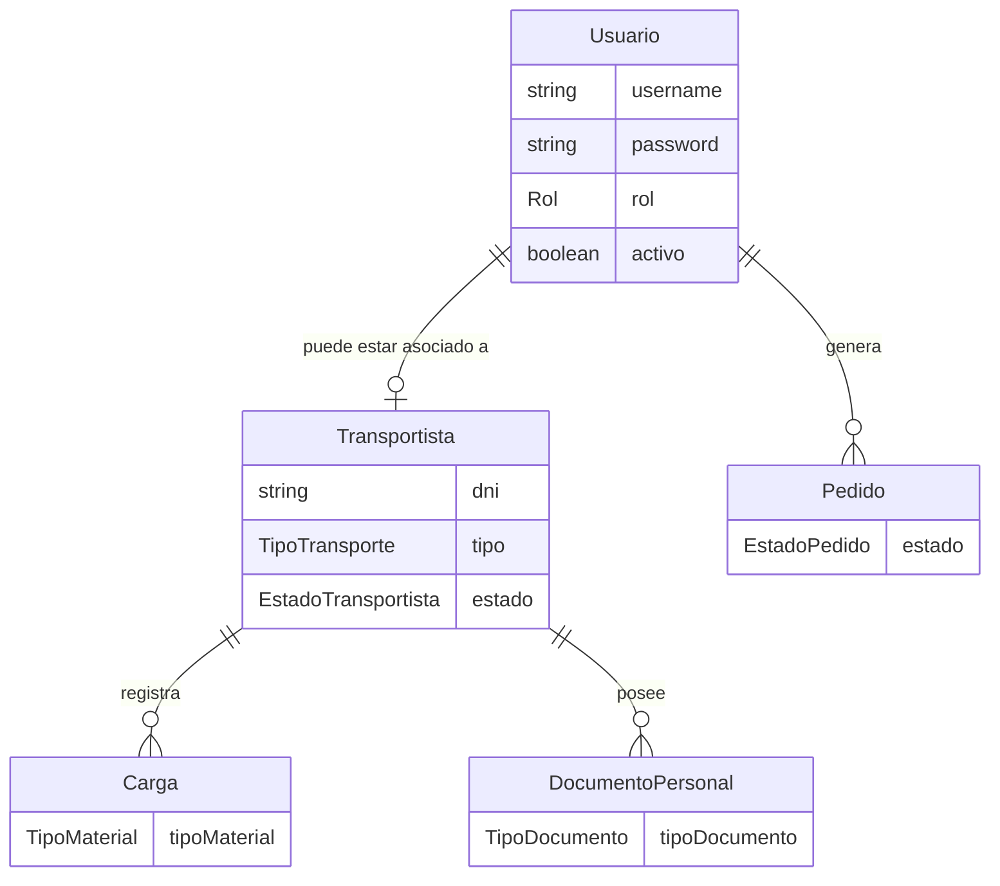

# Modelo de datos

Entidades JPA identificadas en `model/` y sus enumeraciones en `model/enums/`. Cada entidad
principal tiene una entidad de auditoría espejo en `model/audit/`, todas heredando de
`BaseEntity`.

!!! warning "Alcance del diagrama entidad-relación"
    Las relaciones mostradas se infieren de los endpoints existentes (por ejemplo,
    `GET /api/transportistas/usuario/{usuarioId}` y
    `GET /api/transportistas/{id}/documentos`), no de una inspección directa de claves
    foráneas en la base de datos MySQL, la cual está fuera del alcance de este análisis de
    código estático.

## Entidades principales

### Usuario
| Campo | Tipo |
|---|---|
| `username` | `String` (único, obligatorio) |
| `password` | `String` (obligatorio) |
| `rol` | `Rol` (`ADMIN`, `USER`, `TRANSPORTISTA`) |
| `activo` | `Boolean` (por defecto `true`) |

### Enumeraciones de dominio

| Enum | Valores |
|---|---|
| `Rol` | `ADMIN`, `USER`, `TRANSPORTISTA` |
| `EstadoPedido` | `EN_ENVIO`, `EN_DESCARGA`, `ENTREGADO`, `CANCELADO` |
| `EstadoTransportista` | `ACTIVO`, `INACTIVO` |
| `TipoTransporte` | `VOLQUETERO`, `CAMIONERO` |
| `TipoMaterial` | `PANDERETA`, `TECHO`, `ARENA_GRUESA`, `ARENA_FINA`, `ARENA_ASENTAR`, `PIEDRA`, `DESMONTE` |
| `TipoDocumento` | `SOAT`, `REVISION_TECNICA`, `LICENCIA`, `TARJETA_CIRCULACION`, `DNI` |

## Entidades de auditoría

`AuditoriaUsuario`, `AuditoriaPedido`, `AuditoriaCarga`, `AuditoriaTransportista`,
`AuditoriaDocumento`, `AuditoriaAuth` — todas extienden `BaseEntity` y almacenan el historial
de acciones sobre su entidad principal correspondiente, consultable vía
[`/api/auditoria/**`](api-reference.md#auditoria-solo-lectura-apiauditoria).

## Base de datos

- **Motor**: MySQL, base de datos por defecto `astramaco_db`.
- **Estrategia de esquema**: `spring.jpa.hibernate.ddl-auto=update` — Hibernate genera y
  actualiza el esquema automáticamente a partir de las entidades anotadas con `@Entity`.
- **Nota de código**: la entidad `Usuario` está anotada con `@Deprecated` en el código fuente
  de la rama `final-trabajo`, lo que sugiere una posible migración de responsabilidades hacia
  el modelo `Transportista`/roles asociados. Se documenta tal como aparece en el código,
  sin asumir un reemplazo no confirmado.
