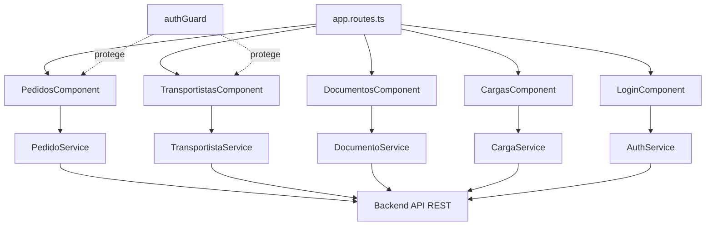

# Frontend Web

**Repositorio**: `Frontend-AstramacoIII` · **Rama oficial**: `entrega-final`

## Stack técnico

- **Angular ^21.2.0** con **componentes standalone** (sin `NgModule` central detectado).
- `@angular/common`, `@angular/forms`, `@angular/router`, `rxjs`.
- **Vitest** como framework de pruebas (`vitest.config.ts`, `src/app/tests/unit`).
- **Prettier** para formateo de código (`.prettierrc`).

## Arquitectura del proyecto



## Organización de carpetas

```text
src/app/
├── config/          # authGuard y configuración transversal
├── models/          # Interfaces TypeScript (Pedido, Transportista, Carga, DocumentoPersonal)
├── pages/           # Componentes de página
│   ├── cargas/
│   ├── documentos/
│   ├── login/         # incluye jwt.interceptor.ts
│   ├── pedidos/
│   └── transportistas/
├── service/         # Servicios HTTP hacia el backend
├── tests/unit/      # Pruebas con Vitest
└── app.routes.ts    # Definición de rutas
```

## Rutas de la aplicación

| Ruta | Componente | Protección |
|---|---|---|
| `/login` | `LoginComponent` | Pública |
| `/` | Redirige a `/login` | — |
| `/pedidos` | `PedidosComponent` | `authGuard` |
| `/transportistas` | `TransportistasComponent` | `authGuard` |
| `/documentos` | `DocumentosComponent` | Sin guard en el código analizado |
| `/cargas` | `CargasComponent` | Sin guard en el código analizado |

## Servicios y comunicación con el Backend

Cada servicio (`PedidoService`, `TransportistaService`, `CargaService`, `DocumentoService`,
`AuthService`) usa `HttpClient` contra `environment.apiUrl` (`.../api`), definido en
`src/environments/environment.ts`, apuntando por defecto al backend desplegado.

`AuthService`:

- `login(data)` → `POST /auth/login`.
- `guardarToken(token)` / `obtenerToken()` → persistencia en `localStorage`.
- `estaLogueado()` → comprobación de sesión activa.
- `logout()` → elimina el token.

`jwt.interceptor.ts` (dentro de `pages/login`) adjunta automáticamente el token JWT a las
peticiones salientes hacia el backend.

Existen además servicios de estado dedicados (`transportista-state.service.ts`,
`documento-state.service.ts`, `pedido-state.service.ts`) para compartir datos entre
componentes sin recargar desde la API en cada navegación.

## Gestión del estado

No se detectó una librería de gestión de estado global (NgRx, Akita, Signals Store); el
estado se comparte mediante servicios Angular inyectables (`providedIn: 'root'`) con
propiedades observables o de estado simple, siguiendo el patrón estándar de servicios
singleton de Angular.
