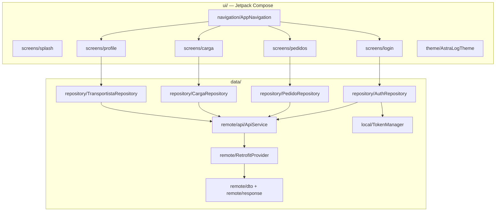

# Aplicación Móvil

**Repositorio**: `AppAstraLog-AstramacoIII` · **Rama oficial**: `entrega-final`

## Stack técnico

- **Kotlin 2.0.21**, **Jetpack Compose** (Compose BOM `2024.09.00`), Material 3.
- **Retrofit 2.9.0** + **Gson converter** + **OkHttp 4.10.0** (con `logging-interceptor`) para
  el consumo de la API REST del backend.
- **Navigation Compose** para la navegación entre pantallas.
- **Kotlin Coroutines** (`kotlinx-coroutines-android`) para operaciones asíncronas.
- **Gradle Kotlin DSL** (`build.gradle.kts`, `libs.versions.toml` como catálogo de versiones).

## Arquitectura por capas



## Organización de carpetas

```text
app/src/main/java/com/example/astralog/
├── data/
│   ├── local/         # TokenManager — persistencia local del JWT
│   ├── remote/
│   │   ├── api/         # ApiService (Retrofit), RetrofitProvider
│   │   ├── dto/          # Objetos de petición
│   │   └── response/     # Objetos de respuesta
│   └── repository/     # AuthRepository, PedidoRepository, CargaRepository, TransportistaRepository
├── ui/
│   ├── navigation/      # AppNavigation
│   ├── screens/         # splash, login, pedidos, carga, profile
│   └── theme/           # AstraLogTheme, Type, Theme
└── utils/
```

## Pantallas (screens)

| Pantalla | Propósito |
|---|---|
| `splash` | Pantalla de carga inicial. |
| `login` | Autenticación del transportista contra `POST /api/auth/login`. |
| `pedidos` | Consulta de pedidos asignados al transportista (`GET /api/pedidos/me`). |
| `carga` | Registro/consulta de cargas del transportista. |
| `profile` | Perfil del transportista y su documentación personal. |

## Comunicación con el Backend

`ApiService` (interfaz Retrofit) define las llamadas HTTP consumidas por los repositorios;
`RetrofitProvider` configura el cliente OkHttp/Retrofit (incluyendo el interceptor de logging
y, previsiblemente, la cabecera `Authorization` con el token JWT gestionado por
`TokenManager`, en consistencia con el mecanismo de autenticación descrito en
[Backend → Seguridad](../backend/seguridad.md)).

Los repositorios (`AuthRepository`, `PedidoRepository`, `CargaRepository`,
`TransportistaRepository`) encapsulan las llamadas a `ApiService` y exponen los datos a las
pantallas Compose, siguiendo un patrón repositorio simple sin una capa `ViewModel`
centralizada explícita más allá de las dependencias de `lifecycle-viewmodel-compose`
declaradas en Gradle.
