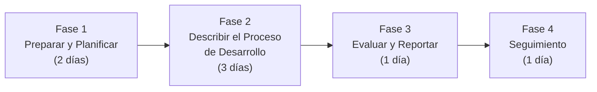

# Criterios y metodología

## 9. Criterios de auditoría

La auditoría se basa en los siguientes marcos normativos y de referencia:

- **ISO/IEC 12207:2017 — Ciclo de Vida del Software**: estándar internacional que establece
  los procesos para la gestión, desarrollo, operación y mantenimiento del software; usado
  para evaluar el cumplimiento de las actividades realizadas durante el ciclo de vida de
  AstraLog.
- **ISO/IEC 25010 — Calidad del Producto de Software**: modelo de calidad que define las
  características de adecuación funcional, eficiencia del desempeño, compatibilidad,
  usabilidad, fiabilidad, seguridad, mantenibilidad y portabilidad.
- **CMMI-DEV**: modelo de madurez para el desarrollo de software, usado para evaluar la
  aplicación de buenas prácticas en gestión de requisitos, planificación, aseguramiento de la
  calidad, gestión de la configuración y mejora de procesos.
- **Checklist SDLC**: lista de verificación adaptada a las fases del SDLC.

## Identificación del stack tecnológico (según el Project Charter)

- Arquitectura monolítica modular.
- Backend Java Spring Boot.
- Frontend Angular.
- Aplicación móvil Flutter *(discrepancia frente al código — ver
  [Discrepancias detectadas](../discrepancias.md))*.
- Base de datos MySQL.
- Autenticación mediante JWT.
- Documentación de API con Swagger/OpenAPI.

## Estándares, metodologías y herramientas aplicadas

- Modelo C4 · Scrum · CMMI · SonarCloud (análisis de calidad) · K6 (pruebas de rendimiento).

## Metodología — Fases de la auditoría

### Fase 1 — Preparar y Planificar (Prepare and Plan)
**Duración estimada**: 2 días.

Actividades: identificación del modelo SDLC, arquitectura y stack tecnológico; identificación
de estándares/metodologías/herramientas; identificación de roles y responsabilidades del
equipo CoreSystems Solutions y de ASTRAMACO III; elaboración del Plan de Auditoría;
elaboración del Checklist SDLC adaptado; comunicación formal de inicio.

**Entregables**: Plan de Auditoría · Checklist SDLC adaptado · Comunicación de inicio.

### Fase 2 — Describir el Proceso de Desarrollo en Detalle
**Duración estimada**: 3 días.

Actividades: entrevistas al equipo de desarrollo; revisión de documentación (Project
Charter, informe del proyecto); revisión de herramientas (Jira, Git/GitHub, SonarCloud,
Swagger/OpenAPI, K6); revisión de la arquitectura monolítica modular y su coherencia; solicitud
y verificación de evidencias conforme al Checklist SDLC.

Temas evaluados: SDLC model, System definition, System requirements, System architecture,
Software requirements, Software architecture, Coding, Unit testing, Code review, Coding
guidelines, Documentation, Deployment & Integration, Defect management, Project management,
Configuration management, Quality Assurance Plan.

**Entregables**: Registro de entrevistas · Registro de evidencias · Papeles de Trabajo de
Auditoría.

### Fase 3 — Evaluar y Reportar (Evaluate and Report)
**Duración estimada**: 1 día.

Actividades: evaluación de la evidencia recopilada frente a los criterios de auditoría
(ISO/IEC 12207, ISO/IEC 25010, CMMI-DEV).

**Entregables**: Matriz de Hallazgos · Matriz de Riesgos · Informe Preliminar de Auditoría ·
Informe Final de Auditoría.

### Fase 4 — Seguimiento (Follow-up)
**Duración estimada**: 1 día.

Actividades: presentación del Informe Final al patrocinador, ASTRAMACO III y CoreSystems
Solutions; elaboración del Plan de Acción Correctiva por el equipo auditado; talleres de
mejora cuando corresponda; seguimiento a la implementación del Plan de Acción Correctiva;
verificación del cierre de hallazgos; elaboración del Acta de Cierre; archivo de papeles de
trabajo y evidencias.
