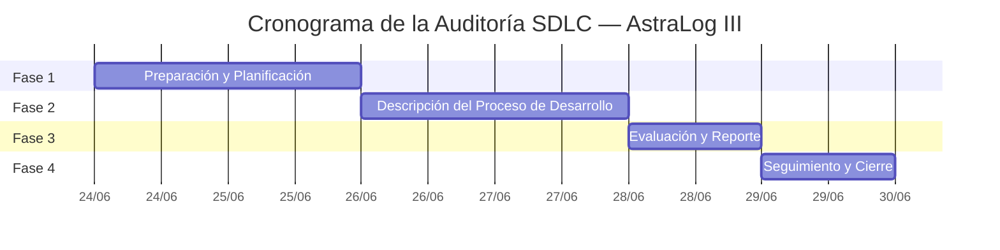

# Cronograma de alto nivel y presupuesto

## 13. Cronograma de alto nivel

| # | Actividad / Hito | Duración | Inicio | Fin | Responsable |
|---|---|---|---|---|---|
| 1 | Inicio del proyecto de auditoría | 1 día | 24/06/2026 | 24/06/2026 | Auditor Líder |
| 2 | FASE 1 – Preparación y Planificación | 2 días | 24/06/2026 | 25/06/2026 | Equipo Auditor |
| 2.1 | Definición de criterios, objetivos y alcance | 1 día | 24/06/2026 | 24/06/2026 | Auditor Líder |
| 2.2 | Identificación del modelo SDLC, arquitectura, tecnologías y estándares | 1 día | 24/06/2026 | 24/06/2026 | Equipo Auditor |
| 2.3 | Elaboración del Plan de Auditoría | 1 día | 25/06/2026 | 25/06/2026 | Auditor Líder |
| 2.4 | Adaptación del Checklist SDLC | 1 día | 25/06/2026 | 25/06/2026 | Equipo Auditor |
| 2.5 | Comunicación de inicio al equipo del proyecto AstraLog | 1 día | 25/06/2026 | 25/06/2026 | Auditor Líder |
| 3 | FASE 2 – Descripción del Proceso de Desarrollo | 2 días | 26/06/2026 | 27/06/2026 | Equipo Auditor |
| 3.1 | Revisión de la documentación del proyecto AstraLog | 1 día | 26/06/2026 | 26/06/2026 | Equipo Auditor |
| 3.2 | Registro de entrevistas y recopilación de evidencias | 1 día | 26/06/2026 | 26/06/2026 | Equipo Auditor |
| 3.3 | Elaboración de los Papeles de Trabajo de Auditoría | 1 día | 27/06/2026 | 27/06/2026 | Equipo Auditor |
| 4 | FASE 3 – Evaluación y Reporte | 1 día | 28/06/2026 | 28/06/2026 | Equipo Auditor |
| 4.1 | Evaluación de evidencias frente a los criterios de auditoría | — | 28/06/2026 | 28/06/2026 | Equipo Auditor |
| 4.2 | Elaboración de la Matriz de Hallazgos y Matriz de Riesgos | — | 28/06/2026 | 28/06/2026 | Equipo Auditor |
| 4.3 | Elaboración del Informe Preliminar e Informe Final de Auditoría | — | 28/06/2026 | 28/06/2026 | Auditor Líder |
| 5 | FASE 4 – Seguimiento y Cierre | 1 día | 29/06/2026 | 29/06/2026 | Equipo Auditor |
| 5.1 | Elaboración del Plan de Acción Correctiva | — | 29/06/2026 | 29/06/2026 | Equipo Auditor |
| 5.2 | Elaboración del Acta de Cierre de Auditoría | — | 29/06/2026 | 29/06/2026 | Auditor Líder |
| 5.3 | Archivo de Papeles de Trabajo | — | 29/06/2026 | 29/06/2026 | Equipo Auditor |
| 6 | Cierre del proyecto de auditoría | 1 día | 29/06/2026 | 29/06/2026 | Auditor Líder |

!!! info "Nota sobre las fechas"
    El cronograma del Project Charter (elaborado el 23/06/2026) planifica el cierre de la
    auditoría hacia el 29/06/2026, mientras que la ficha de "Información General del
    Proyecto" indica una fecha de cierre estimada del 09/09/2026. Ambas fechas se transcriben
    tal como aparecen en el documento original; no se resuelve esta diferencia interna del
    propio Project Charter por tratarse de una inconsistencia editorial del documento fuente,
    no de una diferencia entre documentación y código fuente.

## 14. Presupuesto estimado

| Recurso | Rol | Horas est. | Tarifa/hora | Subtotal |
|---|---|---|---|---|
| Anthony Kelman Mamani Vargas | Auditor Líder | 18 h | S/ 0.00 | S/ 0.00 |
| Yunior Benito Quispe Quispe | Auditor Documental | 14 h | S/ 0.00 | S/ 0.00 |
| Jeimy Paul Ramos Coaquira | Auditor Técnico | 14 h | S/ 0.00 | S/ 0.00 |
| Elvis Jesús Apaza Yucra | Líder del Proyecto AstraLog (equipo auditado) | 14 h | S/ 0.00 | S/ 0.00 |
| Herramientas utilizadas (GitHub, Jira, SonarCloud, Swagger, K6) | Recursos académicos | — | — | S/ 0.00 |
| **TOTAL** | | **60 h** | — | **S/ 0.00 (100%)** |

El presupuesto es de carácter **académico**, sin asignación monetaria real (tarifas en S/
0.00), reflejando que la auditoría se realiza en el marco del curso de Ingeniería de
Software II.
