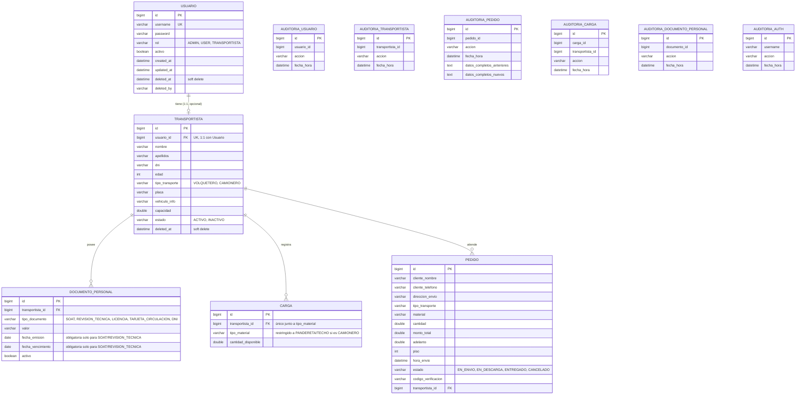

# Base de datos

El backend usa **MySQL** (`astramaco_db`) gestionado por Spring Data JPA/Hibernate con `ddl-auto: update`, es decir, el esquema se genera y actualiza automáticamente a partir de las entidades anotadas con `@Entity`. No se encontraron scripts SQL de migración (ni Flyway ni Liquibase) en el repositorio del backend.

!!! note "Generación automática del esquema"
    Al usar `hibernate.ddl-auto: update`, las tablas, columnas y restricciones documentadas aquí se derivan directamente de las anotaciones JPA en el código fuente (`@Entity`, `@Column`, `@JoinColumn`, `@UniqueConstraint`, etc.), no de un script `.sql` versionado.

## Diagrama entidad-relación

## Restricciones e índices relevantes

| Tabla | Restricción | Detalle |
|---|---|---|
| `usuarios` | `UNIQUE` | `username` único (`@Column(unique = true)`). |
| `usuarios` | Filtro Hibernate | `@Where(clause = "deleted_at IS NULL")` excluye usuarios eliminados de todas las consultas JPA por defecto. |
| `transportistas` | `UNIQUE` | `usuario_id` único — relación 1:1 estricta con `Usuario` (`@OneToOne`). |
| `transportistas` | Filtro Hibernate | Igual que `usuarios`, soft delete transparente vía `@Where`. |
| `cargas` | `UNIQUE COMPOSITE` | `(transportista_id, tipo_material)` — un transportista no puede tener dos registros de carga para el mismo material. |
| `cargas` | `FK` | `transportista_id` `NOT NULL`. |
| `documentos_personales` | `FK` | `transportista_id` `NOT NULL`, relación `@ManyToOne` con `Transportista` (un transportista puede tener varios documentos). |
| `pedidos` | `FK` | `transportista_id` (`@ManyToOne`), puede ser nulo si no se asigna transportista. |
| Todas las entidades de negocio | Auditoría | Heredan de `BaseEntity` (`id`, `createdAt`, `updatedAt`, `deletedAt`, `deletedBy`), generando columnas comunes de trazabilidad temporal en cada tabla. |

## Reglas de negocio reflejadas en el modelo

- Un transportista de tipo **`CAMIONERO`** solo puede registrar/aumentar carga de los materiales **`PANDERETA`** o **`TECHO`** (validado en `CargaService`, no a nivel de base de datos).
- Un **`DocumentoPersonal`** de tipo `SOAT` o `REVISION_TECNICA` exige `fechaEmision` y `fechaVencimiento`; para `LICENCIA` o `TARJETA_CIRCULACION` estas fechas se fuerzan a `NULL` automáticamente (lógica en `@PrePersist`/`@PreUpdate` de la propia entidad `DocumentoPersonal`).
- Un **`Pedido`** solo puede crearse si el `tipoTransporte` del pedido coincide con el del `Transportista` seleccionado; si el transportista es `CAMIONERO`, además se descuenta la cantidad solicitada de su `Carga` disponible (control de stock).
- El **soft delete** es el mecanismo de borrado estándar: `Usuario` y `Transportista` nunca se eliminan físicamente, solo se marca `deletedAt`/`deletedBy`.

## Auditoría como módulo transversal

Cada tabla de negocio principal tiene una tabla de auditoría asociada (`auditoria_usuarios`, `auditoria_transportistas`, `auditoria_pedidos`, `auditoria_cargas`, `auditoria_documentos_personales`, `auditoria_auth`), poblada por `AuditService` en cada operación `CREATE`/`UPDATE`/`DELETE`. Estas tablas almacenan, según el caso, el estado anterior y nuevo serializado (vía Jackson `ObjectMapper`), la IP del request y un timestamp — ver [Backend → Auditoría](../backend/auditoria.md).
