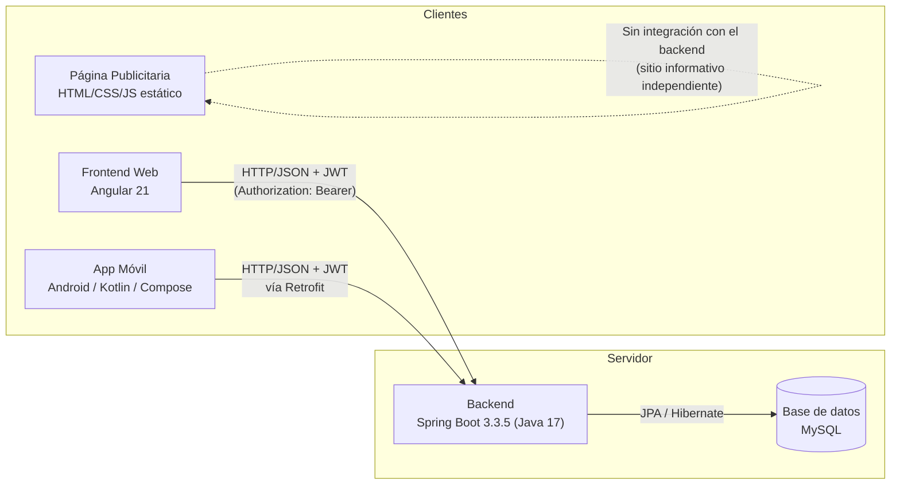
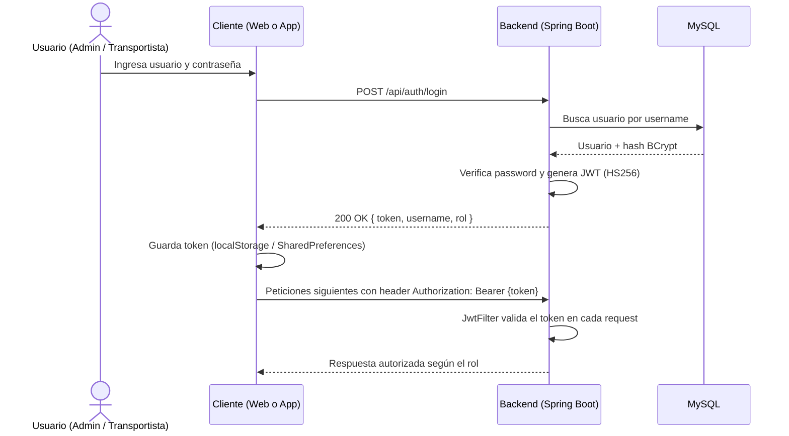
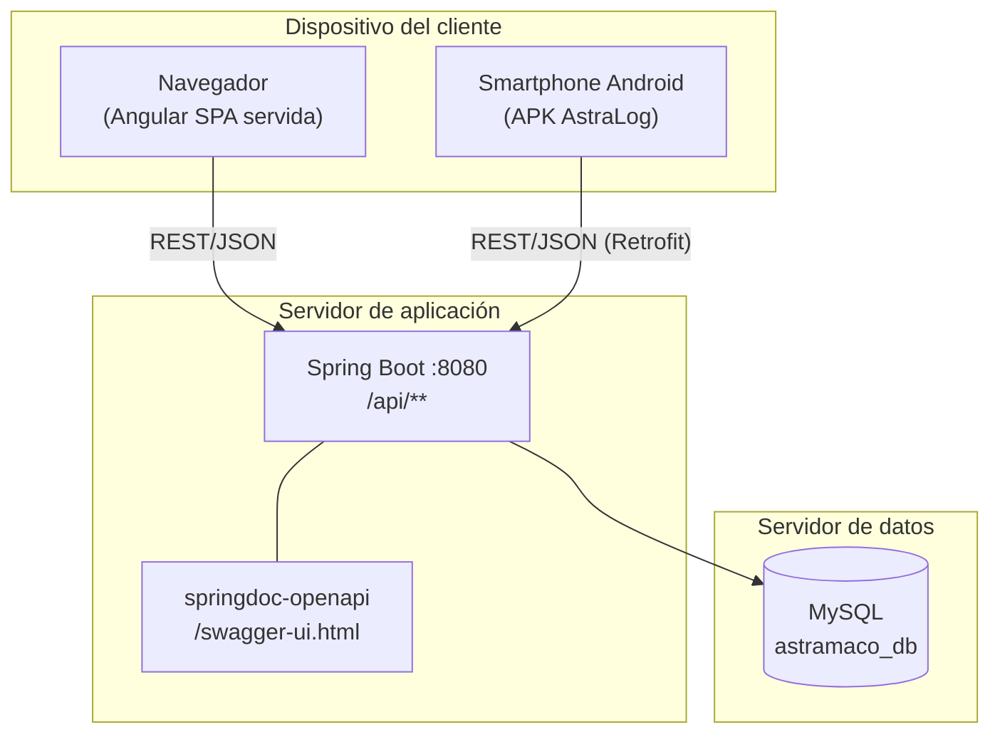

# Arquitectura general

AstraLog III sigue una arquitectura **cliente-servidor desacoplada**: un único backend Spring Boot expone una API REST consumida por tres clientes independientes (web, móvil y, parcialmente, la página publicitaria como sitio estático sin backend propio).

## Componentes y comunicación

!!! warning "Página publicitaria sin integración"
    El repositorio `PaginaPublicitaria-AstramacoIII` es un sitio estático (HTML/CSS/JS puro) sin llamadas a la API del backend ni formularios conectados a un servidor. Es exclusivamente informativo/promocional. Esto se documenta también en [Anexos → Discrepancias detectadas](../anexos/discrepancias.md).

## Flujo de autenticación entre componentes

## Roles del sistema

El backend define tres roles (`enum Rol`) que condicionan el acceso:

| Rol | Descripción |
|---|---|
| `ADMIN` | Administra usuarios, transportistas, pedidos y cargas. Único rol autorizado a crear usuarios (`POST /api/usuarios`). |
| `USER` | Rol genérico de usuario autenticado. |
| `TRANSPORTISTA` | Asociado 1 a 1 a una entidad `Transportista`; consume los endpoints `/me` para ver su propio perfil, pedidos y carga. |

## Vista de despliegue lógico

## Comunicación entre componentes: resumen técnico

| Origen | Destino | Protocolo | Autenticación | Notas |
|---|---|---|---|---|
| Frontend Angular | Backend | HTTP/JSON sobre `environment.apiUrl` (`http://localhost:8080/api`) | JWT vía `jwtInterceptor` (HttpInterceptorFn) | Token leído de `localStorage` |
| App Android | Backend | HTTP/JSON vía Retrofit (`Constants.BASE_URL`) | JWT enviado manualmente como header `Authorization` en cada llamada de `ApiService` | Token persistido con `TokenManager` (SharedPreferences) |
| Backend | MySQL | JDBC / Hibernate (Spring Data JPA) | Credenciales por variables de entorno | `ddl-auto: update` |
| Página publicitaria | — | N/A | N/A | Sin backend propio; es un sitio estático |
