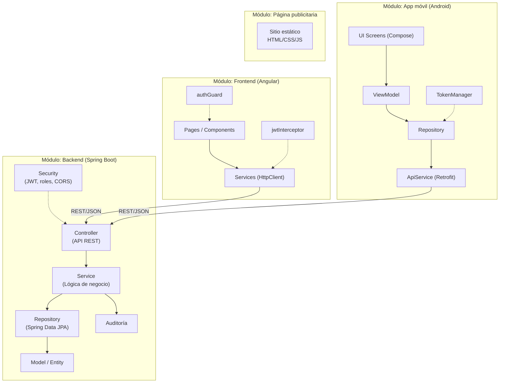

# Arquitectura modular

Cada repositorio del ecosistema AstraLog III es un módulo independiente, desplegable por separado, que se comunica con el backend únicamente a través de su API REST. Dentro del backend, el código además se organiza en una arquitectura en capas típica de Spring Boot.

## Diagrama general de módulos



## Backend: organización de paquetes

El backend (`com.example.backendastramaco`) sigue una arquitectura en capas (Controller → Service → Repository → Model), con módulos transversales de seguridad y auditoría:

```
com.example.backendastramaco
├── controller/            # Endpoints REST por dominio
│   └── auditoria/         # Endpoints de consulta de auditoría
├── dto/                   # Request/Response DTOs
├── exception/             # GlobalExceptionHandler (@RestControllerAdvice)
├── model/                 # Entidades JPA
│   ├── audit/              # Entidades de auditoría + BaseEntity
│   └── enums/               # Enumeraciones de dominio
├── repository/            # Interfaces Spring Data JPA
│   └── audit/               # Repositorios de auditoría
├── security/
│   ├── config/             # SecurityConfig, CorsConfig
│   ├── dto/                 # AuthRequest, AuthResponse
│   ├── jwt/                 # JwtFilter, JwtUtil
│   ├── service/              # CustomUserDetailsService
│   └── swagger/              # OpenApiConfig
├── service/                # Lógica de negocio por dominio
│   └── audit/               # AuditService
└── config/                 # DataInitializer (usuario admin inicial)
```

!!! note "Sin paquete `mapper` dedicado"
    A diferencia de lo solicitado como práctica habitual, el backend **no implementa una capa `mapper` separada** (ni MapStruct ni clases `*Mapper`). El mapeo entre entidades y DTOs se realiza manualmente dentro de cada `Service`, mediante métodos privados como `toResponseDTO(...)`. Esto se documenta como discrepancia frente a una arquitectura "ideal" con mappers explícitos — ver [Discrepancias](../anexos/discrepancias.md).

### Responsabilidad de cada paquete

| Paquete | Responsabilidad |
|---|---|
| `controller` | Expone los endpoints REST, delega en los `service` y traduce a códigos HTTP. Anotado con `@RestController` + Swagger (`@Tag`, `@Operation`, `@ApiResponses`). |
| `service` | Contiene las reglas de negocio (validaciones de tipo de transporte/material, control de stock de carga, generación de código de verificación, etc.) y orquesta repositorios + auditoría. |
| `repository` | Interfaces `JpaRepository` con métodos derivados (`findByUsername`, `findByTransportistaId`, etc.). Sin SQL nativo. |
| `model` | Entidades JPA mapeadas a tablas MySQL, todas extendiendo `BaseEntity` (id, timestamps, soft delete). |
| `dto` | Objetos de entrada/salida desacoplados del modelo de persistencia, con validaciones Bean Validation (`@NotNull`, `@NotBlank`, `@DecimalMin`, etc.). |
| `security` | Configuración de Spring Security: filtro JWT, `UserDetailsService` personalizado, CORS, encoder BCrypt y reglas de autorización por ruta/rol. |
| `service/audit` + `model/audit` + `repository/audit` | Subsistema transversal de auditoría que registra cambios (`CREATE`/`UPDATE`/`DELETE`) sobre pedidos, cargas, transportistas, usuarios, documentos y autenticación. |
| `exception` | Manejador global de excepciones (`@RestControllerAdvice`) que normaliza las respuestas de error. |
| `config` | Configuración de arranque, incluyendo la creación del usuario administrador inicial (`DataInitializer`). |

## Patrones de diseño y principios aplicados

- **Capas en cascada (Layered Architecture)**: Controller → Service → Repository → Model, con dependencia unidireccional.
- **Inyección de dependencias por constructor**: todas las clases usan `@RequiredArgsConstructor` (Lombok) sobre campos `final`, favoreciendo bajo acoplamiento y testabilidad.
- **DTO Pattern**: separación explícita entre el modelo de persistencia (`model`) y los contratos de entrada/salida de la API (`dto`), evitando exponer entidades JPA directamente en la mayoría de endpoints (con la excepción de algunos controladores que sí devuelven `Usuario`/`Transportista`/`DocumentoPersonal` directamente — ver discrepancias).
- **Filter Pattern (Servlet Filter)**: `JwtFilter` extiende `OncePerRequestFilter` y se inserta antes de `UsernamePasswordAuthenticationFilter` en la cadena de seguridad.
- **Soft Delete**: `BaseEntity` centraliza `deletedAt`/`deletedBy` y un método `softDelete(username)`; las entidades `Usuario` y `Transportista` usan además `@Where(clause = "deleted_at IS NULL")` de Hibernate para excluir automáticamente los registros eliminados de las consultas.
- **Auditoría por interceptación de servicio**: cada operación relevante de negocio invoca explícitamente a `AuditService`, que serializa el estado anterior/nuevo (vía Jackson `ObjectMapper`) en tablas de auditoría dedicadas.
- **Builder Pattern**: uso extensivo de Lombok `@Builder` en entidades y DTOs de respuesta.
- **Global Exception Handling**: centralización de errores con `@RestControllerAdvice`, evitando manejo de excepciones disperso en los controladores.

### Acoplamiento y cohesión

- **Alta cohesión por dominio**: cada entidad de negocio (`Usuario`, `Transportista`, `Pedido`, `Carga`, `DocumentoPersonal`) tiene su propio controller, service, repository y DTOs, lo que facilita la mantenibilidad y la extensión.
- **Acoplamiento intencional entre `Pedido`/`Carga`/`Transportista`**: `PedidoService` y `CargaService` dependen de `TransportistaRepository` para validar reglas de negocio cruzadas (p. ej., solo un `CAMIONERO` puede manejar `Carga`, y solo puede operar con materiales `PANDERETA` o `TECHO`). Este acoplamiento es deliberado porque refleja una regla de negocio real, no un defecto de diseño.
- **Bajo acoplamiento con la capa de auditoría**: `AuditService` se inyecta como una dependencia más sin que los servicios de negocio conozcan los detalles de cómo se persiste o serializa el histórico.

## Cómo interactúan los módulos entre sí

1. **Frontend Angular** y **App móvil Android** son consumidores independientes de la misma API REST del backend; no se comunican entre sí directamente.
2. El **Backend** es la única fuente de verdad de los datos (MySQL) y el único punto de autenticación (emisión de JWT).
3. La **página publicitaria** es un módulo aislado, sin dependencia técnica del backend ni de los otros clientes — solo comparte identidad de marca (ASTRAMACO III) y datos de contacto.
4. La seguridad (JWT + roles) actúa como **capa transversal** que cada cliente debe respetar al consumir la API, pero cuya lógica vive exclusivamente en el backend.
