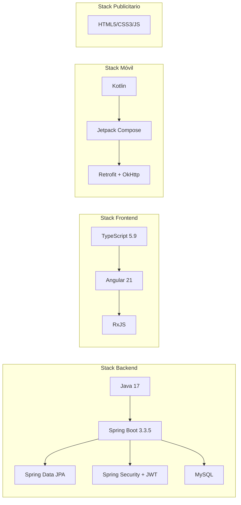

# Tecnologías utilizadas

A continuación se documentan únicamente las tecnologías efectivamente presentes en los repositorios analizados (`pom.xml`, `package.json`, `build.gradle.kts`, `libs.versions.toml`).

## Backend (`Backend-AstramacoIII`)

| Tecnología | Versión | Motivo de uso |
|---|---|---|
| Java | 17 | LTS de Java usado como `java.version` en Maven; requerido por Spring Boot 3.x. |
| Spring Boot | 3.3.5 | Framework principal: arranque rápido, autoconfiguración y ecosistema maduro para APIs REST. |
| Spring Web (`spring-boot-starter-web`) | gestionado por el parent BOM | Construcción de controladores REST. |
| Spring Data JPA | gestionado por el parent BOM | Acceso a datos vía Hibernate con repositorios derivados, evitando SQL boilerplate. |
| Spring Security | gestionado por el parent BOM | Autenticación/autorización, filtros y `PasswordEncoder`. |
| Spring Validation | gestionado por el parent BOM | Validación declarativa de DTOs con Bean Validation (`@NotNull`, `@NotBlank`, etc.). |
| springdoc-openapi (`springdoc-openapi-starter-webmvc-ui`) | 2.5.0 | Generación automática de documentación OpenAPI/Swagger UI a partir de las anotaciones de los controladores. |
| jjwt (`jjwt-api`, `jjwt-impl`, `jjwt-jackson`) | 0.11.5 | Generación y validación de tokens JWT firmados con HMAC. |
| MySQL Connector/J | gestionado por el parent BOM | Driver JDBC para conectar con MySQL. |
| Lombok | 1.18.34 | Reducción de boilerplate (getters/setters/constructores/builders) vía anotaciones y procesamiento en compilación. |
| Testcontainers | 1.21.4 | Pruebas de integración con bases de datos reales (MySQL) en contenedores Docker efímeros. |
| H2 Database | gestionado por el parent BOM | Base de datos en memoria para pruebas. |
| JUnit 5 / Mockito / Spring Security Test | gestionado por el parent BOM | Pruebas unitarias y de seguridad. |
| JaCoCo | 0.8.12 | Cobertura de código, integrado con SonarQube. |
| Maven Surefire / Failsafe | 3.2.5 | Separación de pruebas unitarias (`*UnitTest`) e integración (`*IntegrationTest`). |
| SonarQube Maven Plugin | 3.11.0.3922 | Análisis estático de calidad de código. |
| k6 (scripts JS en `/k6`) | — | Pruebas de carga/estrés (`load-test`, `smoke-test`, `stress-test`) sobre los endpoints de usuarios, pedidos y transportistas. |

## Frontend (`Frontend-AstramacoIII`)

| Tecnología | Versión | Motivo de uso |
|---|---|---|
| Angular (`core`, `common`, `forms`, `router`, `compiler`, `platform-browser`) | ^21.2.0 | Framework SPA para el panel de administración. |
| Angular CLI / `@angular/build` | ^21.2.6 | Tooling de build, dev server y scaffolding. |
| RxJS | ~7.8.0 | Manejo reactivo de las respuestas HTTP (`Observable`). |
| TypeScript | ~5.9.2 | Tipado estático sobre JavaScript. |
| Vitest | ^4.0.8 | Ejecutor de pruebas unitarias (en reemplazo de Karma/Jasmine). |
| jsdom | ^28.0.0 | Entorno DOM simulado para las pruebas con Vitest. |
| Prettier | ^3.8.1 | Formateo de código consistente. |

No se detectaron librerías de UI de terceros (como Angular Material o Bootstrap); los estilos son CSS plano por componente.

## Aplicación móvil (`AppAstraLog-AstramacoIII`)

| Tecnología | Notas | Motivo de uso |
|---|---|---|
| Kotlin | `compileSdk = 36`, `minSdk = 24`, `targetSdk = 36` | Lenguaje oficial de Android moderno. |
| Jetpack Compose | BOM gestionado vía `libs.versions.toml` | UI declarativa (en lugar de XML/Views). |
| Material 3 (`androidx.material3`) | — | Sistema de diseño de componentes visuales. |
| Navigation Compose | — | Navegación declarativa entre pantallas (`NavHost`/`composable`). |
| Lifecycle (runtime, ViewModel Compose) | — | Integración de `ViewModel` con el ciclo de vida de Compose. |
| Retrofit + Gson Converter | — | Cliente HTTP tipado para consumir la API REST del backend. |
| OkHttp + Logging Interceptor | — | Cliente HTTP subyacente de Retrofit, con logging de requests para depuración. |
| Kotlin Coroutines (`kotlinx-coroutines-android`) | — | Llamadas de red asíncronas (`suspend fun`) sin bloquear el hilo principal. |
| JUnit / Espresso / Compose UI Test | — | Pruebas unitarias y de UI instrumentadas. |
| ProGuard | activado en `release` (`isMinifyEnabled`, `isShrinkResources`) | Ofuscación y reducción del tamaño del APK en producción. |

**Arquitectura de capas usada:** MVVM (UI Screen → ViewModel → Repository → ApiService/Retrofit), con `Resource<T>` como wrapper de estado (éxito/error) y `TokenManager` para persistencia local del JWT vía `SharedPreferences`.

## Página publicitaria (`PaginaPublicitaria-AstramacoIII`)

| Tecnología | Motivo de uso |
|---|---|
| HTML5 semántico | Estructura del sitio de una sola página (`index.html`), con secciones ancladas (`#inicio`, `#nosotros`, `#servicios`, `#ubicacion`, `#contacto`). |
| CSS3 (`styles.css`) | Estilado completo del sitio sin frameworks externos. |
| JavaScript vanilla (`main.js`) | Interactividad mínima (14 líneas), sin frameworks ni dependencias de build. |
| Google Maps (iframe embebido) | Mostrar la ubicación física de la empresa en Juliaca. |

No requiere build, gestor de paquetes ni servidor de aplicación: es un sitio estático puro.

## Resumen comparativo

