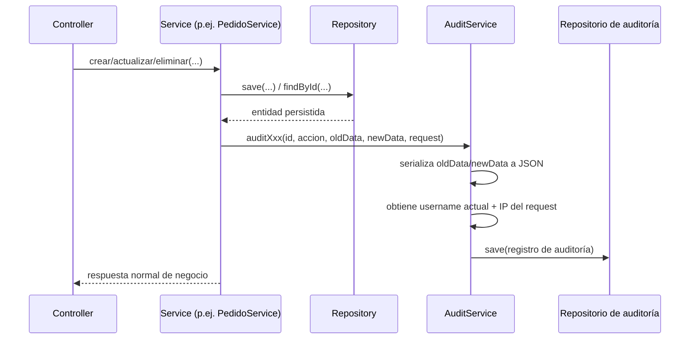

# Auditoría

AstraLog III implementa un subsistema de auditoría transversal que registra el historial de cambios (`CREATE`, `UPDATE`, `DELETE`) sobre las entidades de negocio más sensibles, invocado explícitamente desde cada `Service`.

## Componentes

| Componente | Detalle |
|---|---|
| `service.audit.AuditService` | Servicio único con un método dedicado por dominio: `auditUsuario`, `auditTransportista`, `auditPedido`, `auditDocumento`, `auditCarga`, `auditAuth`. |
| `model.audit.*` | Entidades de auditoría: `AuditoriaUsuario`, `AuditoriaTransportista`, `AuditoriaPedido`, `AuditoriaCarga`, `AuditoriaDocumentoPersonal`, `AuditoriaAuth`. |
| `repository.audit.*` | Repositorios JPA dedicados, con consultas ordenadas por fecha descendente. |
| `controller.auditoria.*` | Exposición de solo lectura de `AuditoriaTransportista` y `AuditoriaUsuario` vía API REST. |

## Datos registrados en cada evento de auditoría

- **Acción:** `CREATE`, `UPDATE` o `DELETE`.
- **Usuario responsable:** obtenido de `SecurityContextHolder` (o `"SYSTEM"` si no hay contexto de autenticación disponible).
- **Fecha y hora:** `LocalDateTime.now()` al momento de la operación.
- **Dirección IP del cliente:** extraída del header `X-Forwarded-For` si existe, o de `request.getRemoteAddr()` como respaldo.
- **Estado anterior y nuevo:** serializados completos en JSON (`ObjectMapper.writeValueAsString`) en las columnas `datosCompletosAnteriores` / `datosCompletosNuevos`.
- **Campos específicos "planos"** para auditorías de `Usuario` y `Transportista` (p. ej. `usernameAnterior`/`usernameNuevo`, `rolAnterior`/`rolNuevo`, `nombreAnterior`/`nombreNuevo`, etc.), que facilitan búsquedas y reportes sin tener que parsear el JSON completo.
- Para `Usuario`, la auditoría **no almacena la contraseña en texto plano ni el hash real**: solo indica si cambió (`passwordCambiada: "SI"/"NO"`).

## Flujo de auditoría en una operación de negocio

## Endpoints de consulta disponibles

| Endpoint | Descripción |
|---|---|
| `GET /api/auditoria/transportistas` | Lista todo el histórico de auditoría de transportistas, ordenado por fecha descendente. |
| `GET /api/auditoria/transportistas/transportista/{transportistaId}` | Histórico de auditoría de un transportista específico. |
| `GET /api/auditoria/usuarios` | Lista todo el histórico de auditoría de usuarios. |
| `GET /api/auditoria/usuarios/usuario/{usuarioId}` | Histórico de auditoría de un usuario específico. |

!!! warning "No existen endpoints de consulta para auditoría de pedidos, cargas y documentos"
    Aunque `AuditService` registra correctamente eventos de `Pedido`, `Carga` y `DocumentoPersonal` en sus respectivas tablas, **no existen controladores REST** que expongan esos históricos (a diferencia de `Usuario` y `Transportista`, que sí los tienen). Esos datos quedan almacenados en base de datos pero solo son consultables directamente sobre MySQL. Ver [Discrepancias](../anexos/discrepancias.md).

!!! warning "Auditoría de autenticación implementada pero no utilizada"
    El método `AuditService.auditAuth(...)` existe y está completamente implementado (registra usuario, IP, user-agent, mensaje de error y éxito/fallo), pero **`AuthController` nunca lo invoca**. En la práctica, los intentos de login (exitosos o fallidos) no quedan registrados en la tabla `auditoria_auth`, aunque la infraestructura para hacerlo ya existe en el código. Ver [Discrepancias](../anexos/discrepancias.md).
