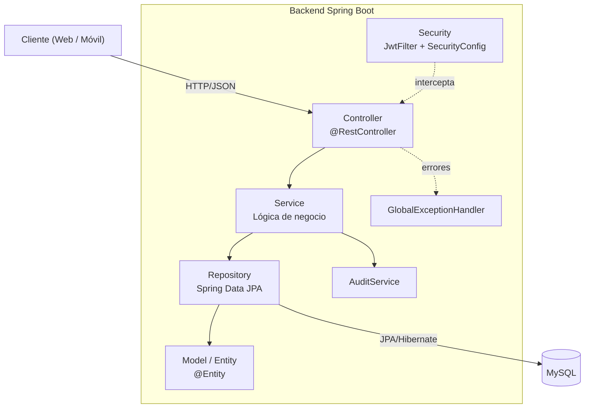

# Capas y paquetes

## Diagrama de capas

## Inventario de clases por paquete

### `controller`

| Clase | Endpoint base | Resumen |
|---|---|---|
| `AuthController` | `/api/auth` | Login y emisión de JWT. |
| `UsuarioController` | `/api/usuarios` | Crear, actualizar y eliminar usuarios. |
| `TransportistaController` | `/api/transportistas` | CRUD de transportistas, filtros por tipo, perfil propio (`/me`). |
| `PedidoController` | `/api/pedidos` | Crear y listar pedidos, listar los propios (`/me`). |
| `CargaController` | `/api/cargas` | Gestión del inventario de carga por transportista. |
| `DocumentoPersonalController` | `/api/documentos` | Registro y consulta de documentos por transportista. |
| `controller.auditoria.AuditoriaTransportistaController` | `/api/auditoria/transportistas` | Consulta del histórico de auditoría de transportistas. |
| `controller.auditoria.AuditoriaUsuarioController` | `/api/auditoria/usuarios` | Consulta del histórico de auditoría de usuarios. |

### `service`

| Clase | Responsabilidad |
|---|---|
| `UsuarioService` | Alta/actualización/baja (soft delete) de usuarios, encriptación de contraseña con `BCryptPasswordEncoder`. |
| `TransportistaService` | Alta de transportista con generación automática de su `Usuario` asociado (username único `nombre.apellido`, password = DNI encriptado), actualización y baja lógica. |
| `PedidoService` | Creación de pedidos con validación de tipo de transporte y descuento de stock de carga si el transportista es `CAMIONERO`; generación de código de verificación fijo (`"1234"`). |
| `CargaService` | Alta/aumento de carga restringido a transportistas `CAMIONERO` y materiales `PANDERETA`/`TECHO`. |
| `DocumentoPersonalService` | Alta/actualización/baja lógica de documentos, con validación de unicidad por tipo de documento y reglas de fechas obligatorias. |
| `service.audit.AuditService` | Registro centralizado de auditoría para usuarios, transportistas, pedidos, cargas, documentos y autenticación. |

### `repository`

Todos extienden `JpaRepository<T, Long>` y usan **métodos derivados** (sin `@Query` manual):

- `UsuarioRepository.findByUsername(String)`
- `TransportistaRepository.findByUsuario(Usuario)`, `findByTipoTransporte(...)`, `findByTipoTransporteAndEstado(...)`
- `PedidoRepository.findByTransportistaIdOrderByHoraEnvioDesc(...)`
- `CargaRepository.findByTransportistaId(...)`
- `DocumentoPersonalRepository.findByTransportistaId(...)`, `existsByTransportistaIdAndTipoDocumento(...)`
- Repositorios de auditoría: `findAllByOrderByFechaHoraDesc()`, `findByTransportistaIdOrderByFechaHoraDesc(...)`, `findByUsuarioIdOrderByFechaHoraDesc(...)`

### `model` y `model.enums`

Ver el detalle completo en [Modelo de dominio](modelo-dominio.md).

### `security`

Ver el detalle completo en [Seguridad y JWT](seguridad.md).

### `exception`

Ver el detalle completo en [Manejo de errores](manejo-errores.md).

### `config`

| Clase | Responsabilidad |
|---|---|
| `DataInitializer` | `CommandLineRunner` que crea, al arrancar la aplicación, un usuario `ADMIN` inicial si no existe, usando `app.admin.username` y `app.admin.password`. Si `app.admin.password` no está configurada, omite la creación y registra una advertencia. |

!!! warning "DTOs sin capa `mapper` dedicada"
    El mapeo `Entity ↔ DTO` se hace manualmente dentro de cada `Service` (p. ej. `PedidoService.toResponseDTO(...)`, `CargaService.toResponseDTO(...)`). No existe un paquete `mapper` ni el uso de MapStruct, pese a que el prompt original asumía su existencia. Ver [Discrepancias](../anexos/discrepancias.md).
