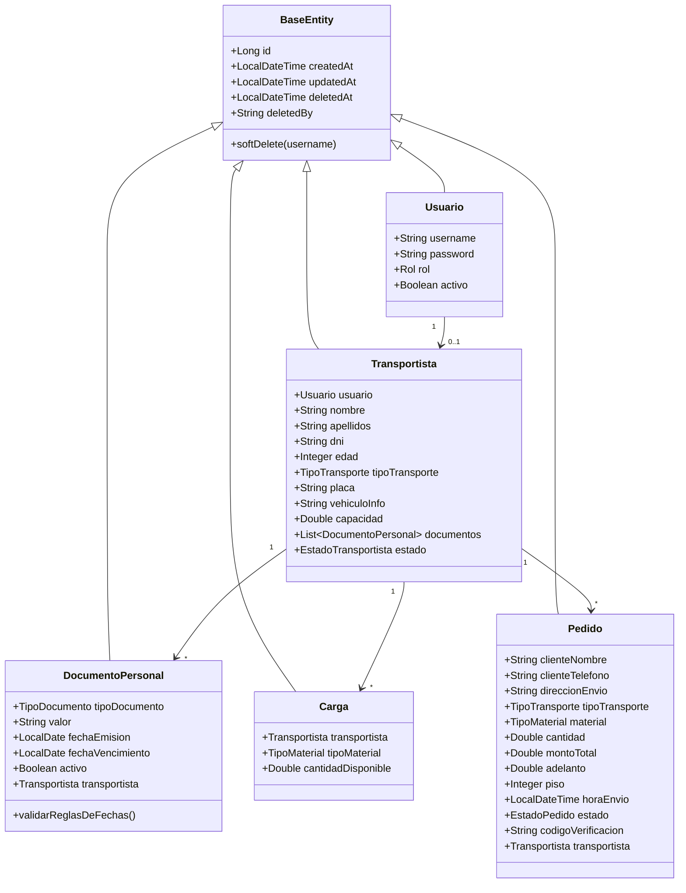

# Modelo de dominio

## Diagrama de clases (entidades)

## `BaseEntity` (clase abstracta común)

Todas las entidades de negocio heredan de `BaseEntity` (`@MappedSuperclass`), que centraliza:

- `id` autogenerado (`IDENTITY`).
- `createdAt` / `updatedAt` (`@CreationTimestamp` / `@UpdateTimestamp` de Hibernate).
- `deletedAt` / `deletedBy` y el método `softDelete(username)` para borrado lógico.

## Enumeraciones de dominio

| Enum | Valores | Uso |
|---|---|---|
| `Rol` | `ADMIN`, `USER`, `TRANSPORTISTA` | Rol de un `Usuario`, usado por Spring Security (`hasRole(...)`). |
| `TipoTransporte` | `VOLQUETERO`, `CAMIONERO` | Tipo de transportista; determina si maneja `Carga`. |
| `TipoMaterial` | `PANDERETA`, `TECHO`, `ARENA_GRUESA`, `ARENA_FINA`, `ARENA_ASENTAR`, `PIEDRA`, `DESMONTE` | Material solicitado en un `Pedido` o registrado en una `Carga`. |
| `EstadoTransportista` | `ACTIVO`, `INACTIVO` | Estado operativo de un transportista. |
| `EstadoPedido` | `EN_ENVIO`, `EN_DESCARGA`, `ENTREGADO`, `CANCELADO` | Ciclo de vida de un pedido (valor por defecto al crear: `EN_ENVIO`). |
| `TipoDocumento` | `SOAT`, `REVISION_TECNICA`, `LICENCIA`, `TARJETA_CIRCULACION`, `DNI` | Tipo de documento personal de un transportista. |

## Reglas de negocio clave (a nivel de entidad y servicio)

### Creación automática de usuario al registrar un transportista

Al dar de alta un `Transportista` (`TransportistaService.crear`), el sistema **crea automáticamente su `Usuario` asociado**:

- `username`: se genera como `primernombre.primerapellido` en minúsculas; si ya existe, se le añade un sufijo numérico incremental (`juan.perez`, `juan.perez1`, `juan.perez2`, …).
- `password`: se inicializa con el **DNI del transportista**, encriptado con BCrypt.
- `rol`: se asigna automáticamente `TRANSPORTISTA`.

!!! danger "Implicación de seguridad relevante"
    Como la contraseña inicial del transportista es su propio DNI, **se debe comunicar y forzar el cambio de contraseña** tras el primer acceso como parte del proceso operativo, ya que el backend actualmente no implementa una funcionalidad de cambio de contraseña obligatorio en el primer login. Ver [Discrepancias](../anexos/discrepancias.md).

### Validación de fechas en documentos (`DocumentoPersonal`)

La propia entidad ejecuta, vía `@PrePersist`/`@PreUpdate`, la regla:

- Si `tipoDocumento` es `SOAT` o `REVISION_TECNICA` → `fechaEmision` y `fechaVencimiento` son **obligatorias**.
- Para cualquier otro tipo (`LICENCIA`, `TARJETA_CIRCULACION`, `DNI`) → ambas fechas se **fuerzan a `null`**, incluso si el cliente las envía.

Adicionalmente, `DocumentoPersonalService.validarDocumento(...)` exige que, para `LICENCIA` y `TARJETA_CIRCULACION`, el campo `valor` sea literalmente `"SI"` o `"NO"` (no distingue mayúsculas/minúsculas).

### Reglas de carga y pedidos para transportistas `CAMIONERO`

- Solo un transportista `CAMIONERO` puede tener `Carga` registrada (`CargaService.obtenerCamioneroValido`).
- Un `CAMIONERO` solo puede manejar materiales `PANDERETA` o `TECHO`.
- Al crear un `Pedido` para un `CAMIONERO`, el sistema valida que exista carga del material solicitado con stock suficiente y **descuenta automáticamente** la cantidad pedida (`PedidoService.procesarCargaSiEsCamionero`).
- Un `VOLQUETERO` no maneja inventario de `Carga`: sus pedidos no descuentan stock.

### Código de verificación de pedidos

Todos los pedidos se crean actualmente con un **código de verificación fijo `"1234"`** (constante `CODIGO_VERIFICACION_POR_DEFECTO` en `PedidoService`), en lugar de un código generado aleatoriamente por pedido. Ver [Discrepancias](../anexos/discrepancias.md).
