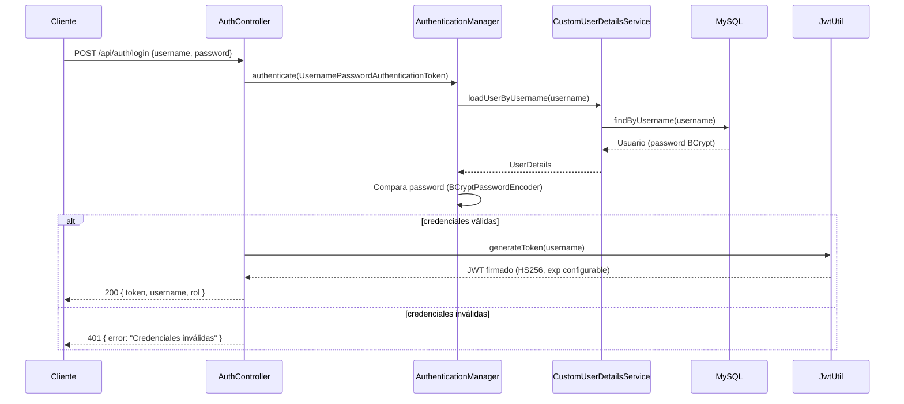
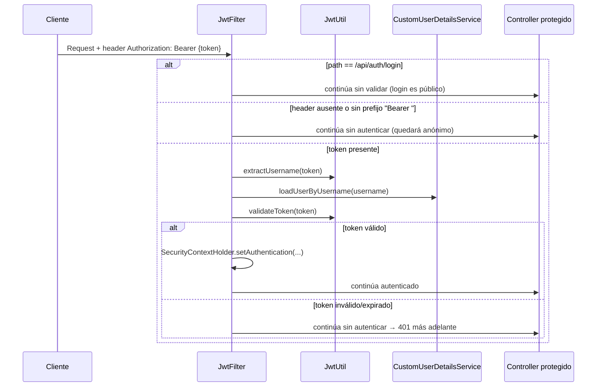

# Seguridad y JWT

## Resumen

El backend implementa autenticación **stateless** basada en **JWT (HS256)** sobre Spring Security 6, con las siguientes piezas:

| Componente | Clase | Función |
|---|---|---|
| Filtro JWT | `security.jwt.JwtFilter` | Intercepta cada request, extrae el token del header `Authorization`, lo valida y construye el `Authentication` en el `SecurityContext`. |
| Utilidad JWT | `security.jwt.JwtUtil` | Genera y valida tokens firmados con clave HMAC derivada de `app.jwt.secret`. |
| `UserDetailsService` | `security.service.CustomUserDetailsService` | Carga el `Usuario` por `username` desde `UsuarioRepository` y lo adapta a `org.springframework.security.core.userdetails.User`. |
| Configuración central | `security.config.SecurityConfig` | Define la cadena de filtros, reglas de autorización por ruta, `AuthenticationProvider`, `PasswordEncoder` y CORS. |
| CORS adicional | `security.config.CorsConfig` | Configuración CORS complementaria vía `WebMvcConfigurer`. |
| Documentación OpenAPI | `security.swagger.OpenApiConfig` | Configuración de springdoc-openapi. |

## Flujo de autenticación (login)

## Validación de requests autenticados

## Generación y validación del token

- **Algoritmo:** HMAC-SHA (`Keys.hmacShaKeyFor(jwtSecret.getBytes())`, vía `io.jsonwebtoken` 0.11.5).
- **Claim principal:** `subject` = `username`.
- **Expiración:** configurable vía `app.jwt.expiration-ms` (por defecto `86400000` ms = 24 horas).
- **Secreto:** `app.jwt.secret`, obligatorio por variable de entorno `APP_JWT_SECRET` (sin valor por defecto en el YAML, debe proveerse en cada entorno).

## Reglas de autorización por ruta (`SecurityConfig`)

| Ruta | Regla | Notas |
|---|---|---|
| `/api/auth/login`, `/api/auth/**` | Público | No requiere token. |
| `/swagger-ui/**`, `/v3/api-docs/**`, `/swagger-ui.html` | Público | Documentación OpenAPI accesible sin autenticación. |
| `/api/usuarios` (cualquier método, vía `permitAll` general) | Público según `requestMatchers` general | Ver nota de discrepancia abajo. |
| `POST /api/usuarios` | Requiere rol `ADMIN` | Definido explícitamente con `requestMatchers(HttpMethod.POST, "/api/usuarios").hasRole("ADMIN")`. |
| Cualquier otra ruta | `authenticated()` | Requiere JWT válido. |

!!! warning "Regla de autorización contradictoria en `/api/usuarios`"
    El código incluye `/api/usuarios` simultáneamente en la lista de rutas con `permitAll()` **y** define una regla más específica `POST /api/usuarios → hasRole("ADMIN")`. En Spring Security, cuando ambas reglas matchean la misma ruta, **se aplica la primera que coincide en el orden declarado**; en este caso, la regla `permitAll()` genérica sobre `/api/usuarios` se evalúa antes que la regla específica por método HTTP, lo cual puede anular en la práctica la restricción `ADMIN` pretendida para `POST`. Se documenta como discrepancia funcional relevante de seguridad — ver [Discrepancias](../anexos/discrepancias.md). Se recomienda **revisar y corregir el orden/especificidad de los `requestMatchers`** antes de un despliegue productivo.

## Otras configuraciones de seguridad

- **CSRF:** deshabilitado (`csrf.disable()`), apropiado para una API stateless consumida por clientes JWT.
- **Sesión:** `SessionCreationPolicy.STATELESS` — no se mantiene sesión HTTP en el servidor.
- **Manejo de errores de autenticación:** `HttpStatusEntryPoint(HttpStatus.UNAUTHORIZED)` devuelve `401` ante intentos de acceso no autenticado a rutas protegidas.
- **Encriptación de contraseñas:** `BCryptPasswordEncoder` (bean `passwordEncoder()`).
- **CORS (`SecurityConfig`):** orígenes permitidos `http://localhost:4200` y `http://localhost:8080`; métodos `GET, POST, PUT, DELETE, OPTIONS`; todos los headers permitidos; `allowCredentials: true`.
- **CORS (`CorsConfig`, redundante):** registra una segunda configuración CORS vía `WebMvcConfigurer` con origen `http://localhost:4200` y todos los métodos/headers — coexiste con la configuración de `SecurityConfig`.

!!! note "Doble configuración CORS"
    Existen dos configuraciones CORS independientes (`SecurityConfig.corsConfigurationSource()` y `CorsConfig.corsConfigurer()`). Aunque ambas son consistentes con `localhost:4200` como origen permitido, mantener dos fuentes de configuración para la misma preocupación transversal es redundante y puede dificultar el mantenimiento — ver [Discrepancias](../anexos/discrepancias.md).

## Roles y permisos por endpoint (resumen funcional)

| Endpoint | Rol requerido en el código | Cómo se aplica |
|---|---|---|
| `POST /api/auth/login` | Ninguno (público) | `permitAll()` |
| `POST /api/usuarios` | `ADMIN` (declarado), pero ver discrepancia arriba | `hasRole("ADMIN")` |
| `PUT/DELETE /api/usuarios/{id}` | Cualquier usuario autenticado | Cae en la regla general `anyRequest().authenticated()`; no hay `@PreAuthorize` adicional en el controlador. |
| Resto de endpoints (`/api/transportistas`, `/api/pedidos`, `/api/cargas`, `/api/documentos`, `/api/auditoria/**`) | Cualquier usuario autenticado | No se encontraron anotaciones `@PreAuthorize`/`@Secured` a nivel de método; el control de "quién puede ver qué" depende de la lógica de negocio (p. ej. `/me` filtra por el usuario autenticado), no de restricciones de rol explícitas en estos controladores. |

!!! info "Sobre el control de roles fino"
    El prompt de referencia esperaba documentación de "roles y permisos" detallada por endpoint. En la implementación real, **la mayoría de endpoints solo exige "estar autenticado"**, sin diferenciar por rol a nivel de Spring Security (`hasRole`/`@PreAuthorize`). Las descripciones Swagger de algunos endpoints (p. ej. *"Listar transportistas (solo ADMIN)"*) son **comentarios de intención en la documentación OpenAPI**, no restricciones técnicas reales aplicadas por el framework. Esto se documenta como discrepancia — ver [Anexos → Discrepancias](../anexos/discrepancias.md).
