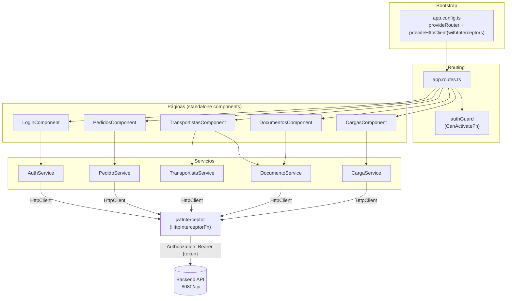

# Arquitectura Angular

## Estructura de carpetas

```
src/app/
├── app.config.ts          # Bootstrap: providers (Router, HttpClient + interceptores)
├── app.routes.ts          # Definición de rutas
├── app.ts / app.html       # Componente raíz
├── config/
│   └── authGuard.ts        # Guard funcional de autenticación
├── models/                 # Interfaces TypeScript (contratos con la API)
├── pages/                  # Un folder por página/feature
│   ├── login/
│   │   ├── login.component.ts
│   │   └── jwt.interceptor.ts   # Interceptor HTTP (vive junto al login)
│   ├── pedidos/
│   ├── transportistas/
│   ├── documentos/
│   └── cargas/
└── service/                 # Servicios HTTP por dominio
```

## Diagrama de arquitectura



## Componentes standalone

Todos los componentes (`LoginComponent`, `PedidosComponent`, `TransportistasComponent`, `DocumentosComponent`, `CargasComponent`) usan la API moderna de Angular **standalone** (`standalone: true`, con `imports: [FormsModule, CommonModule]` declarados directamente en el decorador `@Component`), sin `NgModule` alguno en todo el proyecto. El arranque de la aplicación (`main.ts`) usa `bootstrapApplication` con el `appConfig` centralizado en `app.config.ts`.

## Formularios

El frontend utiliza **Template-Driven Forms** (`FormsModule` + `[(ngModel)]`) en todos los formularios (login, alta de transportista, alta de documento), en lugar de Reactive Forms (`FormGroup`/`FormControl`). No se encontró uso de `ReactiveFormsModule` en el proyecto.

## Modelos (contratos con el backend)

| Modelo | Archivo | Corresponde a |
|---|---|---|
| `Pedido` | `models/pedido.model.ts` | `PedidoResponseDTO` / `PedidoRequestDTO` del backend |
| `Transportista` | `models/transportista.model.ts` | Entidad `Transportista` del backend |
| `TransportistaConDocs` | `models/transportista-con-docs.model.ts` | Extiende `Transportista` con un mapa `documentosMap` de presencia de documentos por tipo (construido en el frontend, no proviene directamente del backend) |
| `DocumentoPersonal` | `models/documento-personal.model.ts` | Entidad `DocumentoPersonal` del backend |
| `CargaModel` | `models/carga.model.ts` | `CargaResponseDTO`/`CargaRequestDTO` del backend |

!!! note "Estados de pedido en el frontend vs. backend"
    El modelo `Pedido` del frontend declara el estado `'PENDIENTE'` como valor posible (`estado?: 'PENDIENTE' | 'EN_ENVIO' | 'EN_DESCARGA' | 'ENTREGADO' | 'CANCELADO'`), pero el enum `EstadoPedido` del backend **no incluye `PENDIENTE`** (solo `EN_ENVIO`, `EN_DESCARGA`, `ENTREGADO`, `CANCELADO`). Es una inconsistencia menor de tipado entre frontend y backend — ver [Discrepancias](../anexos/discrepancias.md).
