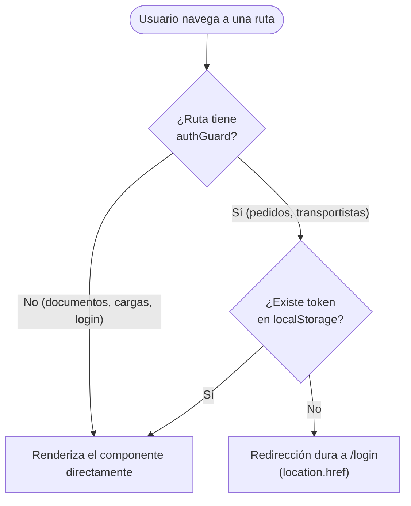

# Routing y guards

## Tabla de rutas (`app.routes.ts`)

```typescript
export const routes: Routes = [
  { path: 'login', component: LoginComponent },
  { path: '', redirectTo: 'login', pathMatch: 'full' },
  { path: 'pedidos', component: PedidosComponent, canActivate: [authGuard] },
  { path: 'transportistas', component: TransportistasComponent, canActivate: [authGuard] },
  { path: 'documentos', component: DocumentosComponent },
  { path: 'cargas', component: CargasComponent }
];
```

## `authGuard` (guard funcional)

```typescript
export const authGuard: CanActivateFn = () => {
  const token = localStorage.getItem('token');
  if (token) return true;
  globalThis.location.href = '/login';
  return false;
};
```

- Implementado con la API funcional de guards de Angular (`CanActivateFn`), introducida como alternativa moderna a las clases `CanActivate`.
- La verificación es puramente local: **comprueba la sola existencia** de un valor en `localStorage.getItem('token')`, sin validar su firma, expiración o estructura.
- Si no hay token, fuerza una recarga completa del navegador hacia `/login` (`globalThis.location.href`) en lugar de usar el `Router` de Angular para una navegación SPA.

!!! note "El guard no valida la validez real del token"
    `authGuard` solo verifica que exista *algún* valor en `localStorage`, no que el JWT sea válido o no haya expirado. Un token expirado seguiría "pasando" el guard en el cliente; la protección real ocurre recién cuando el backend rechaza la petición con `401`. Esto es un comportamiento común en SPAs simples, pero conviene tenerlo presente como limitación de seguridad en el cliente — ver [Discrepancias](../anexos/discrepancias.md).

## `jwtInterceptor` (interceptor HTTP funcional)

```typescript
export const jwtInterceptor: HttpInterceptorFn = (req, next) => {
  const token = localStorage.getItem('token');
  if (token) {
    const cloned = req.clone({ setHeaders: { Authorization: `Bearer ${token}` } });
    return next(cloned);
  }
  return next(req);
};
```

- Registrado en `app.config.ts` vía `provideHttpClient(withInterceptors([jwtInterceptor]))`.
- Añade automáticamente el header `Authorization: Bearer {token}` a **todas** las peticiones HTTP salientes (incluyendo, técnicamente, el propio `POST /api/auth/login`, aunque en ese caso no habrá token aún en el primer login).

## Flujo de navegación protegida


