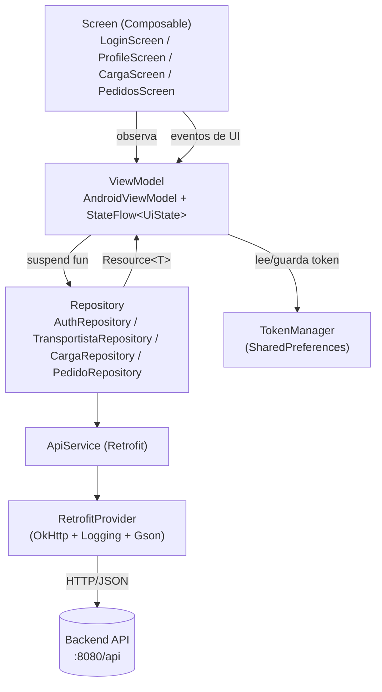

# Arquitectura Android

## Estructura de paquetes

```
com.example.astralog/
├── MainActivity.kt
├── data/
│   ├── local/
│   │   └── TokenManager.kt          # Persistencia del JWT (SharedPreferences)
│   ├── remote/
│   │   ├── api/
│   │   │   ├── ApiService.kt         # Interfaz Retrofit
│   │   │   └── RetrofitProvider.kt   # Construcción del cliente Retrofit/OkHttp
│   │   ├── dto/                      # Cuerpos de request (LoginRequest, CargaRequest, ...)
│   │   └── response/                 # DTOs de respuesta (AuthResponse, CargaResponse, ...)
│   └── repository/                   # AuthRepository, CargaRepository, PedidoRepository, TransportistaRepository
├── ui/
│   ├── navigation/
│   │   └── AppNavigation.kt           # NavHost declarativo
│   ├── screens/
│   │   ├── splash/   SplashScreen.kt
│   │   ├── login/    LoginScreen.kt + LoginViewModel.kt + LoginUiState.kt
│   │   ├── profile/  ProfileScreen.kt + ProfileViewModel.kt + ProfileUiState.kt
│   │   ├── carga/    CargaScreen.kt + CargaViewModel.kt + CargaUiState.kt
│   │   └── pedidos/  PedidosScreen.kt + PedidosViewModel.kt + PedidosUiState.kt
│   └── theme/         AstraLogTheme.kt, Theme.kt, Type.kt
└── utils/
    ├── Constants.kt    # BASE_URL
    └── Resource.kt     # Wrapper sellado: Success / Error / Loading
```

## Diagrama de capas (MVVM)



## Patrón `Resource<T>`

Todas las llamadas de red en los `Repository` devuelven un wrapper sellado `Resource<T>`:

```kotlin
sealed class Resource<out T> {
    data class Success<T>(val data: T) : Resource<T>()
    data class Error(val message: String) : Resource<Nothing>()
    object Loading : Resource<Nothing>()
}
```

Cada `Repository` envuelve las llamadas Retrofit en un `try/catch`, devolviendo `Resource.Error("Error de conexión: ${e.message}")` ante fallos de red, y `Resource.Error("...")` con un mensaje específico cuando `response.isSuccessful == false`. Los `ViewModel` consumen este resultado con un `when` exhaustivo y actualizan su `UiState` (`MutableStateFlow`) correspondiente, que la `Screen` Compose observa con `collectAsState()`.

## Autenticación y persistencia del token

- `TokenManager` envuelve `SharedPreferences("astralog_prefs")` con métodos `saveToken`, `getToken`, `clearToken`, `isLoggedIn`.
- A diferencia del frontend web (que usa un interceptor HTTP global), la app móvil **agrega el header `Authorization` manualmente** en cada llamada de `ApiService`, ya que cada método de la interfaz Retrofit declara explícitamente `@Header("Authorization") token: String`. No existe un `Interceptor` de OkHttp dedicado a inyectar el token automáticamente.

```kotlin
interface ApiService {
    @POST("auth/login")
    suspend fun login(@Body request: LoginRequest): Response<AuthResponse>

    @GET("transportistas/me")
    suspend fun getTransportistaMe(@Header("Authorization") token: String): Response<TransportistaResponse>

    @GET("cargas/{transportistaId}")
    suspend fun getCargaByTransportista(@Path("transportistaId") transportistaId: Long, @Header("Authorization") token: String): Response<CargaResponse?>

    @PUT("cargas/{transportistaId}")
    suspend fun subirCargaActual(@Path("transportistaId") transportistaId: Long, @Body request: CargaRequest, @Header("Authorization") token: String): Response<CargaResponse>

    @POST("cargas/{transportistaId}/aumentar")
    suspend fun aumentarCargaActual(@Path("transportistaId") transportistaId: Long, @Body request: AumentarCargaRequest, @Header("Authorization") token: String): Response<CargaResponse>

    @GET("pedidos/me")
    suspend fun getMisPedidos(@Header("Authorization") token: String): Response<List<PedidoResponse>>
}
```

!!! note "Cobertura parcial de la API desde la app móvil"
    La app móvil **no implementa la edición del perfil del transportista**, ni la gestión de documentos personales (`/api/documentos`), aunque esos endpoints existen en el backend. Su alcance funcional se limita a: login, ver perfil propio, gestionar carga propia (si es `CAMIONERO`) y ver los pedidos propios.
