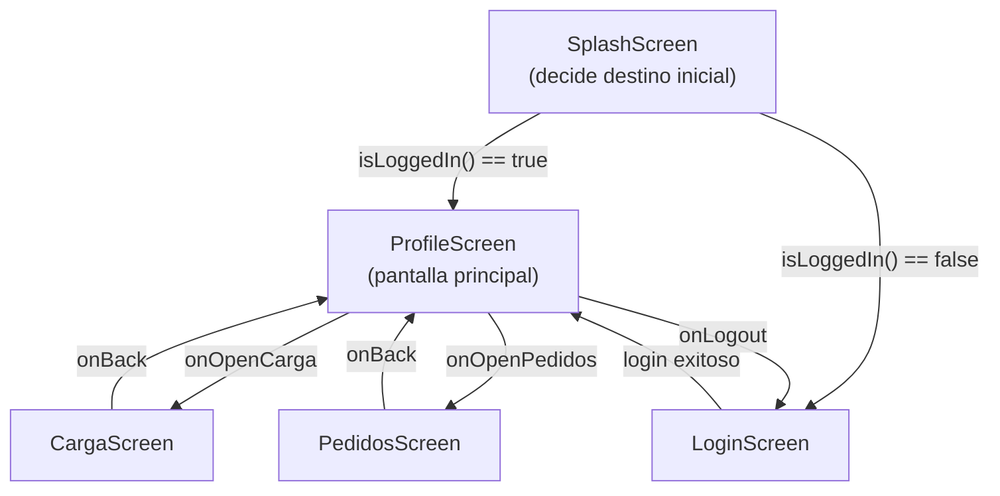

# Pantallas y navegación

## Grafo de navegación (`AppNavigation.kt`)

La navegación usa **Navigation Compose** (`NavHost`/`composable`), con el destino inicial (`startDestination`) resuelto dinámicamente: `AppNavigation` consulta `TokenManager.isLoggedIn()` dentro de un `LaunchedEffect` y decide entre `"profile"` y `"login"` antes de montar el `NavHost` (mostrando `SplashScreen` mientras tanto).

## Detalle de pantallas

### `SplashScreen`

Pantalla de carga inicial mostrada mientras se determina si existe una sesión activa (`TokenManager.isLoggedIn()`).

### `LoginScreen` + `LoginViewModel`

- Formulario de `username`/`password`.
- Al autenticar correctamente, `LoginViewModel` guarda el token con `TokenManager.saveToken(...)` y notifica éxito vía `LoginUiState`.
- Consume `AuthRepository.login(username, password)` → `POST /api/auth/login`.

### `ProfileScreen` + `ProfileViewModel`

- Pantalla principal tras el login; muestra los datos del transportista autenticado.
- Consume `TransportistaRepository.getPerfil(token)` → `GET /api/transportistas/me`.
- Expone navegación hacia `CargaScreen` y `PedidosScreen`.
- `ProfileViewModel.logout()` limpia el token (`TokenManager.clearToken()`), lo que dispara el regreso a `LoginScreen`.

### `CargaScreen` + `CargaViewModel`

Pantalla de gestión de inventario, **exclusiva para transportistas `CAMIONERO`**:

1. Carga primero el perfil del transportista (`TransportistaRepository.getPerfil`).
2. Si `tipoTransporte != "CAMIONERO"`, muestra el error *"Solo los transportistas CAMIONERO manejan carga"* y no continúa.
3. Si es `CAMIONERO`, consulta la carga actual (`CargaRepository.obtenerCarga`) — un `404` del backend se interpreta como "sin carga registrada aún" (`Resource.Success(null)`), no como error.
4. Permite **registrar/sobrescribir** la carga (`CargaRepository.subirCargaActual` → `PUT /api/cargas/{id}`) y **aumentar** la cantidad disponible (`CargaRepository.aumentarCargaActual` → `POST /api/cargas/{id}/aumentar`).

Esta es, según el código analizado, **la única interfaz de usuario del ecosistema que permite crear o modificar cargas** (el frontend web solo las consulta).

### `PedidosScreen` + `PedidosViewModel`

- Lista los pedidos asignados al transportista autenticado.
- Consume `PedidoRepository.obtenerMisPedidos(token)` → `GET /api/pedidos/me`.
- Pantalla de **solo lectura**: no permite crear, editar ni cambiar el estado de un pedido desde la app móvil (esas operaciones, de existir, ocurrirían desde el panel de administración web, aunque tampoco `PedidosComponent` del frontend expone cambio de estado — ver [Discrepancias](../anexos/discrepancias.md)).

## Funcionalidades cubiertas vs. no cubiertas por la app móvil

| Funcionalidad | ¿Disponible en la app móvil? |
|---|---|
| Login / Logout | ✅ |
| Ver perfil propio | ✅ |
| Ver carga propia y registrar/aumentar inventario (solo `CAMIONERO`) | ✅ |
| Ver pedidos propios | ✅ (solo lectura) |
| Crear/editar pedidos | ❌ No implementado |
| Gestión de documentos personales | ❌ No implementado |
| Edición de datos del perfil | ❌ No implementado |
| Auditoría | ❌ No implementado |
