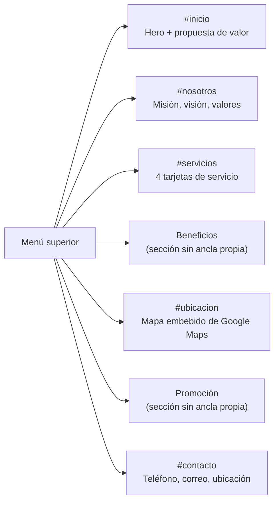

# Página publicitaria

El repositorio `PaginaPublicitaria-AstramacoIII` contiene un **sitio web estático de una sola página** (one-page site), de carácter puramente informativo/promocional para ASTRAMACO III. No tiene backend propio ni se integra con la API de AstraLog III.

## Estructura del repositorio

```
PaginaPublicitaria-AstramacoIII/
├── index.html      # 315 líneas — todo el contenido de la página
├── styles.css       # 450 líneas — estilos
├── main.js          # 14 líneas — scroll suave en el menú
└── img/
    └── logo-astramaco.jpeg
```

No existe `package.json`, build tool ni dependencias: el sitio se sirve directamente como archivos estáticos.

## Flujo de navegación (secciones ancladas)



`main.js` implementa **scroll suave** (`scrollIntoView({ behavior: "smooth" })`) al hacer clic en los enlaces del menú que apuntan a anclas internas (`href^="#""`), interceptando el comportamiento por defecto del navegador.

## Contenido del sitio

| Sección | Contenido |
|---|---|
| **Hero (`#inicio`)** | Título, descripción de la propuesta de valor y tres tarjetas destacadas: *Atención directa*, *Entrega organizada*, *Soporte tecnológico*. |
| **Nosotros (`#nosotros`)** | Misión, Visión y Valores (Responsabilidad, Puntualidad, Transparencia, Seguridad, Calidad, Ambiente laboral amigable). |
| **Servicios (`#servicios`)** | Gestión de pedidos, Asignación de transportistas, Seguimiento de entregas, Venta de materiales. |
| **Beneficios** | Cuatro razones para elegir ASTRAMACO III (entrega puntual, atención personalizada, organización/transparencia, soporte tecnológico). |
| **Ubicación (`#ubicacion`)** | Dirección textual (Av. Andrés Avelino Cáceres con Pachacútec, Juliaca, Puno) + `<iframe>` de Google Maps embebido + enlace a Google Maps. |
| **Promoción** | Anuncio de presencia próxima en Facebook (placeholder, sin enlace activo todavía). |
| **Contacto (`#contacto`)** | Teléfono (`916 859 627`), correo (`astramacoiiitransportistas@gmail.com`) y enlace a ubicación. |

## Datos de contacto extraídos del sitio

| Dato | Valor |
|---|---|
| Teléfono | `916 859 627` |
| Correo electrónico | `astramacoiiitransportistas@gmail.com` |
| Dirección | Av. Andrés Avelino Cáceres con Pachacútec, Juliaca, Puno, Perú (cerca de la Feria de Carros) |

## Configuración y despliegue

Al ser HTML/CSS/JS puro sin dependencias ni build step, el despliegue se reduce a publicar los archivos en cualquier hosting estático (GitHub Pages, Netlify, Vercel, o un servidor web tradicional sirviendo el directorio tal cual) — ver [Despliegue](despliegue.md).

!!! info "Sin integración con el backend"
    A diferencia de lo que el prompt original podía sugerir, esta página **no realiza ninguna llamada HTTP a la API de AstraLog III**, no tiene formularios de contacto conectados a un servidor, ni consume datos dinámicos. Es exclusivamente un sitio de presentación institucional. Ver [Discrepancias](anexos/discrepancias.md).
